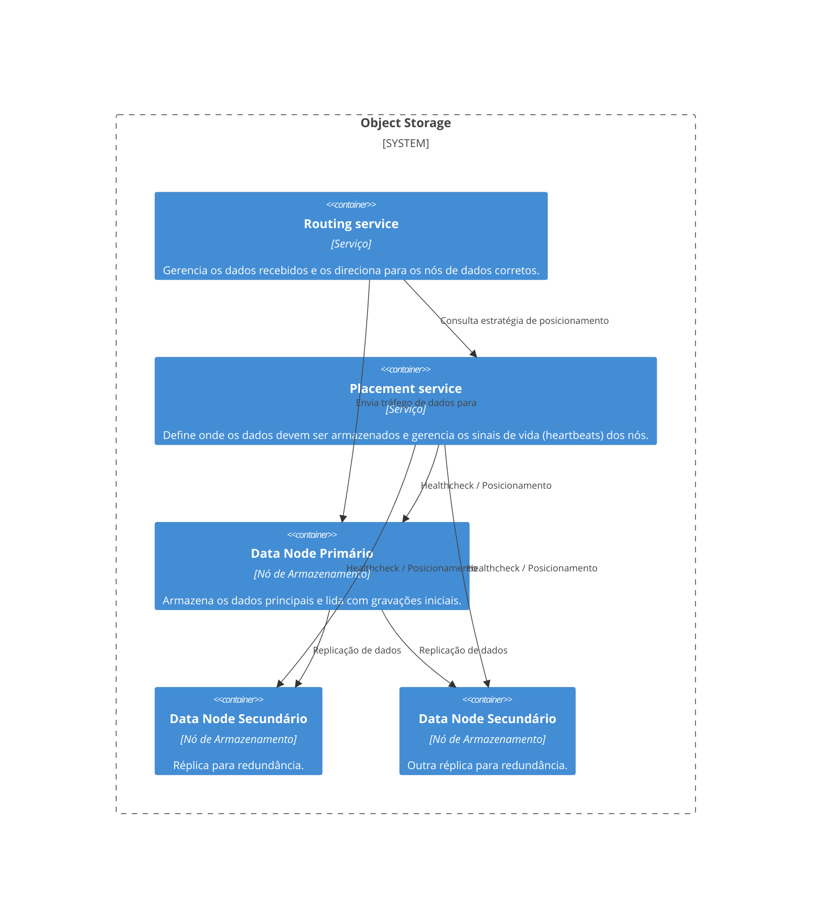
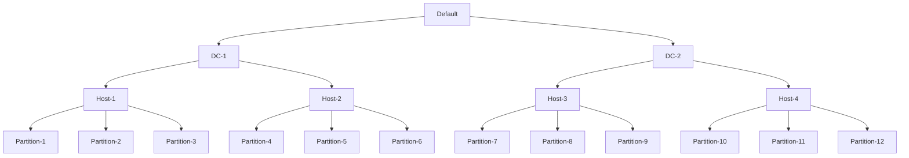
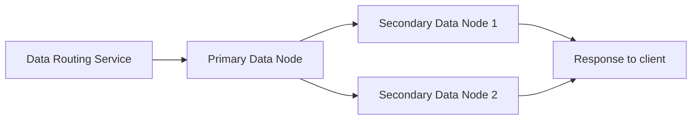
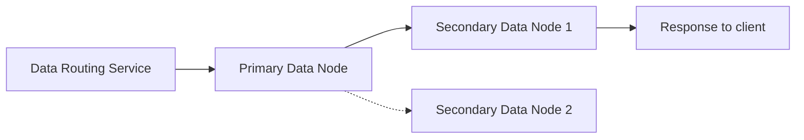
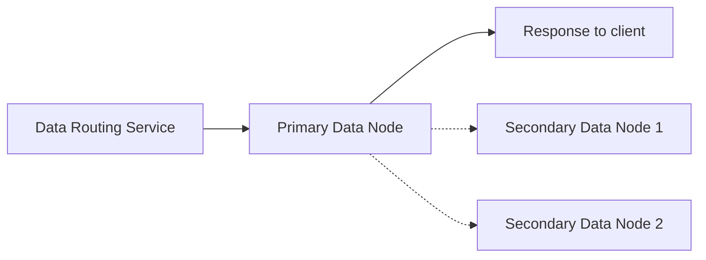
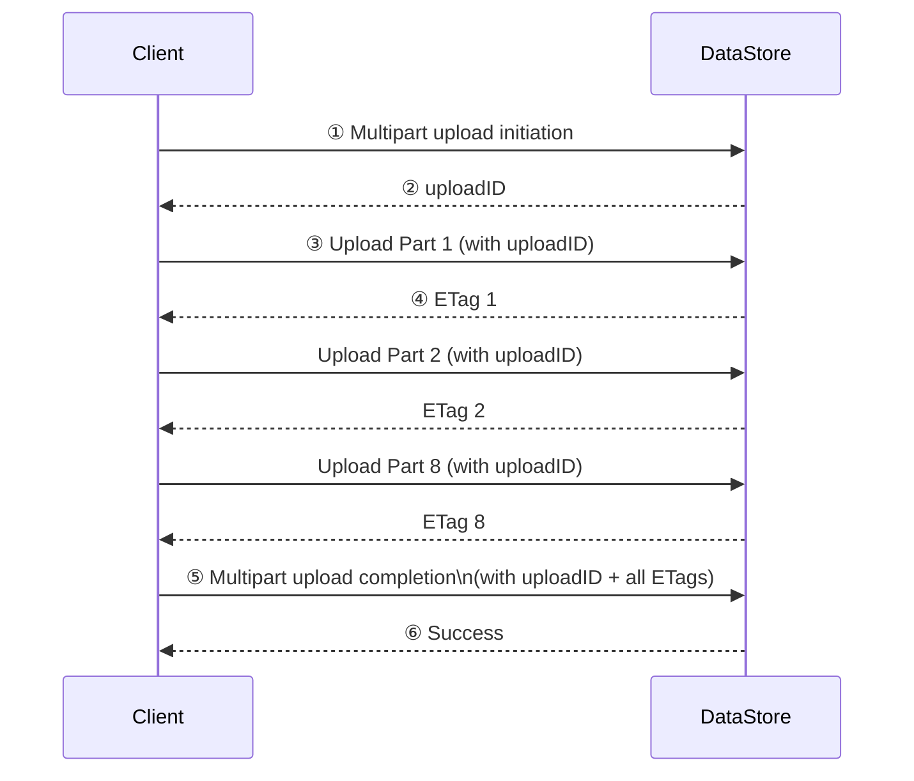

Seguindo com nosso Clube do Livro, chegamos ao cápitulo 25 do livro System Design Interview. Neste cápitulo o desafio proposto é o design de um sistema de storage nos moldes de um Amazon S3, um storage de objetos.

Este capítulo nos traz os seguintes requisitos funcionais:

- Criação de buckets
- Upload e download de objetos
- Versionamento de objetos
- Listar objetos em um bucket

E também os seguintes requisitos não funcionais:

- 100 Petabytes de dados por ano
- Durabilidade de 99,9999%
- Disponibilidade de 99,99%
- Eficiência de storage (reduce storage costs)

Dados os requisitos funcionais e não-funcionais acima, nossa missão é desenhar este sistema de maneira satisfatória demonstrando nossos conhecimentos de system design e principalmente nossas habilidades de reconhecer trade-offs e tomar decisões assertivas, baseadas neles. 

Porém, neste artigo, não precisamos seguir a risca o script da entrevista como o autor segue no capítulo, já que para isto, bom... temos o livro e o capítulo. Neste artigo vamos passar por um subset de tópicos importantes e interessantes que são abordados, os quais em caso de acabarmos na situação real em que este desafio seja pedido em uma entrevista ou no dia a dia, estejamos preparados.

## Índice do que iremos abordar

- [Os três tipos de sistemas de armazenamento](#os-três-tipos-de-sistemas-de-sistemas-de-armazenamento)
- [Terminologia](#terminologia)
- [O que é "inode" e como esse conhecimento pode nos ajudar](#o-que-é-inode-e-como-esse-conhecimento-pode-nos-ajudar)
- [Proposta para Armazenamento: Routing e Placement Services](#proposta-para-armazenamento-routing-e-placement-services)
- [O trade-off entre latência e consistência](#o-trade-off-entre-latência-e-consistência)
- [Organização dos Dados](#organização-dos-dados)
- [Durabilidade dos Dados: Replicas ou Erasure Coding?](#durabilidade-dos-dados-replicas-ou-erasure-coding)
- [Verificação de Integridade dos Dados](#verificação-de-integridade-dos-dados)
- [Modelo de Dados dos Metadados e Sharding](#modelo-de-dados-dos-metadados-e-sharding)
- [Versionamento dos Objetos](#versionamento-dos-objetos)
- [Otimizando o Upload de Grandes Objetos](#otimizando-o-upload-de-grandes-objetos)
  - [Como funciona o Multipart Upload](#como-funciona-o-multipart-upload)
  - [Tratamento de partes antigas](#tratamento-de-partes-antigas)
  - [Multipart Upload é o mesmo que multipartform-data](#multipart-upload-é-o-mesmo-que-multipartform-data)
- [Garbage Collection](#garbage-collection)
  - [Quando os dados se tornam lixo](#quando-os-dados-se-tornam-lixo)
  - [Como o Garbage Collector funciona](#como-o-garbage-collector-funciona)
  - [Coleta de Lixo e Replicação](#coleta-de-lixo-e-replicação)
- [Conclusão](#conclusão)

## Os três tipos de sistemas de armazenamento

Antes de entendermos a fundo como funciona um armazenamento de objetos como o S3, é fundamental conhecermos os três tipos principais de sistemas de armazenamento:

- **Block Storage**: é a forma mais primitiva e flexível de armazenamento, onde dados são armazenados em blocos. Ideal para bancos de dados e VMs. Alta performance, mas com maior custo e menor escalabilidade. Block storage veio primeiro, no ano de 1960. HDs e SSD que são tipicamente colocados em servidoes são exemplos de block storage.

- **File Storage**: utiliza block storage por baixo dos panos, mas oferece uma abstração mais amigável com pastas e arquivos. É o que usamos no dia a dia com protocolos como com NFS, SMB, etc. Geralmente usado em ambientes corporativos. Os servidores ou clientes acessando um File Storage não precisam se preocupar em lidar com os blocos em baixo nível.

- **Object Storage**: ideal para grandes volumes de dados não estruturados e de acesso eventual. Não há estrutura hierárquica de pastas; tudo é armazenado como “objetos” com metadados e identificadores únicos. Essa abordagem foca em durabilidade e escala, sacrificando performance.

### Comparando os tipos:

#### **Armazenamento em Bloco**
- **Conteúdo Mutável:** Sim  
- **Custo:** Alto  
- **Performance:** Média a alta, muito alta  
- **Consistência:** Consistência forte  
- **Acesso aos Dados:** SAS / iSCSI / FC  
- **Escalabilidade:** Escalabilidade média  
- **Indicado para:** Máquinas virtuais (VM), aplicações de alta performance como bancos de dados  

#### **Armazenamento em Arquivo**
- **Conteúdo Mutável:** Sim  
- **Custo:** Médio a alto  
- **Performance:** Média a alta  
- **Consistência:** Consistência forte  
- **Acesso aos Dados:** Acesso padrão a arquivos, CIFS/SMB e NFS  
- **Escalabilidade:** Alta escalabilidade  
- **Indicado para:** Acesso a sistemas de arquivos generalistas  

#### **Armazenamento em Objeto**
- **Conteúdo Mutável:** Não (versões são suportadas, mas não há atualização in-place)  
- **Custo:** Baixo  
- **Performance:** Baixa a média  
- **Consistência:** Consistência forte  
- **Acesso aos Dados:** API RESTful  
- **Escalabilidade:** Escalabilidade massiva  
- **Indicado para:** Dados binários, dados não estruturados  

## Terminologia

- **Bucket**: contêiner lógico de objetos, com nome único global.

- **Object**: dados armazenados em um bucket. Inclui payload (conteúdo) e metadados.

- **URI**: cada objeto/bucket pode ser acessado via URI RESTful.

- **Versionamento**: permite manter múltiplas versões de um mesmo objeto.

- **SLA**: acordos de serviço sobre durabilidade e disponibilidade (ex: 99.9999% de durabilidade).

## O que é "inode" e como esse conhecimento pode nos ajudar

No UNIX, os arquivos são referenciados por inodes, estruturas que armazenam os metadados e apontam para os blocos reais de dados em disco. O inode (Index Node) é armazenado em um local e o arquivo em si é armazenado em outro. Os inodes contem uma lista que aponta para os blocos de dados daquele arquivo no disco fisico.

A arquitetura de sistemas de storage de objetos adota um conceito similar: os meta dados são salvos em locais diferentes dos arquivos, agindo como o inode, guardando informações como UUID, nome do objeto, e bucket e onde está o arquivo; enquanto a data store armazena efetivamente os dados.

Essa separação permite escalar e otimizar cada componente de forma independente, o que também traz benefícios para o design, onde podemos lidar com estes componentes com diferentes designs tambem.

Alguns pontos interessantes sobre os inodes:

- Inodes são estruturas de dados que armazenam todas as informações de um arquivo exceto seu nome e seus dados de fato

- Os inodes arnazenam: Tamanho, Permissão, Owner/Grupo, Localização no disco, data, entre outras informações

- Cada arquivo possui um inode

- O sistema tem limite de inodes, pode ser que você receba uma mensagem de não ter mais espaço em seu HD por causa dos inodes e não por causa do espaço em si

- O número de inodes é decidido na criação do filesystem

- O padrão é 1 inode a cada 2 kilobytes de espaço em disco

Para saber mais sobre inodes acess [Everything You Need to Know About inodes in Linux](https://linuxhandbook.com/inode-linux/) e/ou [Inodes and the Linux filesystem](https://www.redhat.com/en/blog/inodes-linux-filesystem).

## Proposta para Armazenamento: Routing e Placement Services

No design proposto no capítulo, a proposta para :

- **Routing Service**: recebe as requisições e direciona o objeto para o local correto, mas para saber qual o local correto utiliza o serviço de placement que vai lhe fornecer a localização para buscar ou gravar dados.

- **Placement Service**: define, via mapa virtual do cluster, para onde os dados devem ir, garantindo separação física (por rack, AZ, etc.) para aumentar a durabilidade. Este serviço mantem uma árvore que serve de mapa entre os data centers, AZs, clusters e partições, e sempre se mantém atualizado quanto a saúde destes nós. Fornece as informação de onde o serviço de routing pode enviar novos dados ou buscar dados.

- **Nós de dados / Data Nodes**: São os serviços que de fato guardam os dados, trabalhando durabilidade e confiabilidade através de replicação entre os nós primários e secundários.
    - As mensagens de heartbeat incluem:
        - Quantos discos o nó possui
        - Quanto de dados já está em cada disco
    - Quando o placement service recebe pela primeira vez um hearbeat, ele registra o novo nó e retorna:
        - ID único para o nó
        - O mapa virtual do cluster
        - Aonde deve replicar

Esse modelo distribui dados em múltiplos nós, com um primário e replicações secundárias, garantindo resiliência contra falhas.

O design dos serviços e componentes ficaria assim:

Enquanto um exemplo do mapa que o Placement Service mantém em memória é:

## O trade-off entre latência e consistência

No tópico acima falamos sobre a replicação dos dados, e isso sempre levanta uma questão: "Quando podemos considerar um dado salvo? Quando salvamos no nó primário? Quando está replicado em todos os nós?"

Esta pergunta depende de como nosso sistema pode lidar com alguns trade-offs, e qual o requisito não funcional mais importante entre latência e consistência. 

Abaixo alguns níveis de como podemos considerar os dados "salvos com sucesso":

- **Após replicar em todos os nós**: maior consistência, maior latência

- **Após replicar em 2 de 3 nós**: trade-off médio entre consistência e performance

- **Apenas após escrita no nó primário** baixa latência, consistência eventual

Esses trade-offs são importantes e devem ser alinhados com os requisitos do sistema.

## Organização dos Dados

Agora vamos pensar em como cada nó de dados gerenciará os objetos. 

Uma solução simples é armazenar cada objeto em um arquivo individual. Embora isso funcione, o desempenho sofre quando há muitos arquivos pequenos. Dois problemas surgem ao ter muitos arquivos pequenos em um sistema de arquivos.

- Primeiro, ocorre o desperdício de blocos de dados. Um sistema de arquivos armazena os arquivos em blocos discretos de disco. Esses blocos têm um tamanho fixo, geralmente determinado quando o volume é inicializado, sendo o tamanho típico cerca de 4 KB. Mesmo que um arquivo seja menor que 4 KB, ele ainda consome um bloco de disco inteiro. Portanto, se o sistema tiver muitos arquivos pequenos, uma grande quantidade de blocos será desperdiçada, cada um sendo utilizado parcialmente por um arquivo pequeno.

- Segundo, pode exceder a capacidade de inodes do sistema. O sistema de arquivos guarda a localização e outras informações sobre cada arquivo em um tipo especial de bloco chamado inode. Na maioria dos sistemas de arquivos, o número de inodes é fixado na inicialização do disco. Com milhões de arquivos pequenos, corre-se o risco de consumir todos os inodes disponíveis. Além disso, o sistema operacional não lida bem com um grande número de inodes, mesmo com um cache agressivo dos metadados do sistema de arquivos. Por essas razões, armazenar pequenos objetos em arquivos individuais não funciona bem na prática.

Para resolver esses problemas, podemos juntar vários objetos pequenos em um arquivo maior. Conceitualmente, funcionando como um (Write-Ahead Log, WAL).

Nesta estratégia, cada objeto é salvo em um arquivo já existente, mediante uma organização e estratégia. Assim que um arquivo atingir um limite, este arquivo é marcado como somente leitura e um novo arquivo é criado.

Alguns pontos quanto a esta estratégia:

- O acesso de escrita deve ser serializado
- Podemos ter arquivos dedicados a cada núcleo de processamento, otimizando o paralelismo

Desta maneira, ainda temos mais um desafio, quando um componente externo quiser recuperar um arquivo, os nós de dados precisam ser capazes de retornálos, mas para isto ele precisam ser capazes de localizá-los. Para isto podemos ter um data store em cada nó que tenha o seguinte modelo:

- Object ID
- Nome do arquivo
- Offset no arquivo
- Tamanho do arquivo

Com estes dados o nó será capaz de receber um id e retornar o objeto correspondente de maneira eficiente. 

Mas para guardarmos estes dados precisamos pensar em qual mecanismo de data-store faz mais sentido neste cenário, algumas opções e considerações abaixo;

- Rocks DB
    - Baseado em SSTable
    - Rápido para escrita, porém não otimizado para leitura
    - Para saber mais sobre o Rocks DB acesse o [site oficial](https://rocksdb.org/)
    - Para saber mais sobre SStable acesse [este artigo sobre SSTable no blog do ScyllaDB](https://www.scylladb.com/glossary/sstable/)

- SQL data base
    - Normalmente baseados em B-Trees, rápido para leitura
    - Uma ótima opção dados os requisitos de leitura maior que escrita
    - Uma opção confiável e light-weight baseada em arquivos, seria o SQLite

## Durabilidade dos Dados: Replicas ou Erasure Coding?

Um grande desafio neste projeto é quanto a durabilidade dos dados, sabemos que podemos enfretar diversos casos adversos, seja falhas físicas em HDs ou SSDs ou também falhas na escrita ou mesmo memória ou arquivos corrompidos, causando falhas no armazenamento e afetando a durabilidade.

### Replicação (x3): 

Uma solução mais simples de implementar, e que já falamos, seria a replicação dos dados. Isto seria:
- Simples de implementar
- Baixa latência
- ~6 noves de durabilidade
- mas com 200% de overhead de armazenamento.

Abaixo vamos falar de uma segunda opção, que se encaixa melhor em nosso requisitos não funcionais.

### Erasure Coding

Comparado aos métodos tradicionais de replicação, o erasure coding oferece o mesmo nível de proteção dos dados com uma sobrecarga de armazenamento significativamente menor. Essa eficiência é alcançada armazenando dados de paridade em vez de múltiplas cópias completas dos dados.

Para entender melhor esta técnica, recomendamos a leitura [deste artigo do Geeks: Erasure Coding in System Design](https://www.geeksforgeeks.org/erasure-coding-in-system-design/) ou assistir [este vídeo do canal da ferramenta MinIO: Overview of MinIO Erasure Coding](https://www.youtube.com/watch?v=QniHMNNmbfI).

- Aumenta durabilidade (~11 noves)
- Reduz overhead  de armazenamento em 50%
- Mas adiciona latência e complexidade para leitura e escrita.

Para sistemas sensíveis à latência, replicação ainda é a escolha mais comum. Porém um requisito não funcional muito forte em nosso projeto é otimização de custo de storage, por isto, neste projeto vamos optar por Erasure Coding.

## Verificação de Integridade dos Dados

Mesmo dados replicados podem sofrer corrupção silenciosa. Para resolver isso, podemos adicionar a nosso sistema **checksums** (ex: MD5, SHA1, HMAC) ao final de cada objeto.

Antes de retornar um objeto ao cliente, o checksum é recalculado e comparado ao original. Se estiver errado, tenta-se recuperar de outra réplica.

Também podemos adicionar checksums ao final de cada arquivo, para garntir a integridade do arquivo como um todo, assim como também de cada objeto salvo.

## Modelo de Dados dos Metadados e Sharding

Dois modelos principais:

- Tabela de Buckets: pequena, pode ficar em um único banco com réplicas para leitura.

- Tabela de Objetos: precisa ser particionada. O ideal é usar um hash de (bucket_name, object_name) para sharding, o que distribui bem e permite buscar por URI, já que o bucket e o nome do objeto fazem parte da URI.

- Uma idéia que o livro explora para otimizar a listagem de objetos é utilizar uma tabela desnormalizada focada na listagem, fazendo o sharding por bucket id.

Para listar objetos por prefixo, é necessário agrupar resultados em múltiplos shards, o que complica a paginação. Uma solução é desnormalizar os dados de listagem em outra tabela, focada apenas nisso.

## Versionamento dos Objetos

A feature de versionamento visa manter diferentes versões de um mesmo arquivo no sistema, desta maneira podemos recuperar arquivos que foram acidentalmente apagados ou sobre-escritos.

Sem o versionamento, assim que uma nova versão de um arquivo é salva, os metadados são sobre-escritos e os dados anteriores são marcados para remoção.

Com versionamento, agora as versões anteriores não são apagadas. Para isto, precisamos:

- **Adicionar configuração de versionamento ao bucket:**

- **Ajustar o esquema da base de metadados:**
  - Adicionar uma nova coluna `object_version` na tabela de objetos do metadata store.
  - Essa coluna só será usada se o versionamento estiver habilitado.

- **Alterar o comportamento de upload de objetos:**
  - Em vez de sobrescrever o registro existente:
    - **Inserir** um novo registro com o mesmo `bucket_id` e `object_name`.
    - Gerar um novo `object_id` (UUID) para identificar o novo conteúdo.
    - Gerar um novo `object_version` (TIMEUUID) para diferenciar as versões.

- **Persistir os dados no data store como um novo objeto:**
  - Armazenar o conteúdo com um novo identificador (UUID).
  - Isso garante que cada versão tenha seu próprio dado independente.

- **Atualizar lógica de leitura (GET):**
  - Retornar a versão mais recente de acordo com o maior `object_version` (TIMEUUID).
  - Essa será considerada a “versão atual” do objeto.

- **Implementar suporte a delete marker:**
  - Ao deletar um objeto:
    - Inserir um novo registro com um `object_version` mais recente.
    - Marcar como “delete marker” (sem deletar as versões anteriores).
  - Uma requisição GET que cair sobre um delete marker deve retornar 404.

- **Garantir que o sistema de garbage collection respeite o versionamento:**
  - Nunca deletar objetos antigos automaticamente se o versionamento estiver habilitado.
  - Apenas objetos explicitamente excluídos de forma permanente devem ser removidos.

## Otimizando o Upload de Grandes Objetos

Em sistemas de armazenamento de objetos, é comum lidarmos com arquivos de diversos tamanhos. Embora a maioria seja relativamente pequena, uma parcela significativa — cerca de 20%, segundo estimativas — pode conter arquivos com vários gigabytes. Fazer o upload de arquivos tão grandes de uma só vez é possível, mas arriscado: qualquer falha na conexão durante a transferência pode exigir o reenvio do arquivo inteiro, resultando em perda de tempo e largura de banda.

Para lidar com esse problema, entra em cena o **multipart upload**: uma técnica que permite dividir arquivos grandes em partes menores e fazer o upload de cada uma delas separadamente. Essa abordagem traz uma série de benefícios, como tolerância a falhas, paralelização do upload e retomada de partes específicas.

### Como funciona o Multipart Upload

O processo de multipart upload é composto pelas seguintes etapas:

1. **Inicialização do upload**:  
   O cliente faz uma requisição à API do serviço de armazenamento para iniciar um upload multipart. O serviço responde com um `uploadID`, que identifica exclusivamente essa operação.

2. **Divisão do arquivo**:  
   O cliente divide o arquivo grande em partes menores. Por exemplo, um arquivo de 1.6 GB pode ser dividido em 8 partes de 200 MB cada.

3. **Upload das partes**:  
   Cada parte é enviada individualmente, acompanhada do `uploadID`. Para cada parte enviada, o serviço retorna um **ETag**, que é um hash (geralmente MD5) usado para verificar a integridade dos dados.

4. **Finalização do upload**:  
   Quando todas as partes forem enviadas, o cliente faz uma requisição de finalização (`complete multipart upload`), informando o `uploadID`, os números das partes e seus respectivos ETags.

5. **Recomposição do objeto**:  
   O serviço reagrupa as partes com base na ordem especificada e monta o arquivo completo. Como o processo pode envolver grandes volumes de dados, ele pode levar alguns minutos para ser concluído. Uma vez finalizado, uma mensagem de sucesso é retornada ao cliente.

### Tratamento de partes antigas

Após o objeto ser reconstituído com sucesso, as partes individuais usadas no processo perdem sua utilidade. Para evitar acúmulo desnecessário de dados no armazenamento, recomenda-se a implementação de um **serviço de coleta de lixo** (garbage collection), responsável por liberar o espaço ocupado por essas partes obsoletas.

### Multipart Upload é o mesmo que `multipart/form-data`?

Embora os nomes sejam parecidos, é importante não confundir o **multipart upload** com o tipo de conteúdo `multipart/form-data`, utilizado em formulários HTML para envio de arquivos. Enquanto `multipart/form-data` serve para enviar formulários e arquivos em uma única requisição, o **multipart upload** foi projetado especificamente para gerenciar uploads de **arquivos grandes**, com **resiliência e paralelização**, em sistemas de armazenamento de objetos como o Amazon S3, Google Cloud Storage ou serviços compatíveis.

## Garbage Collection

Em sistemas de armazenamento de objetos, nem todos os dados permanecem úteis para sempre. Objetos deletados, uploads incompletos ou dados corrompidos ocupam espaço desnecessário e precisam ser removidos — é aí que entra o **garbage collector**, ou coletor de lixo.

A coleta de lixo é o processo responsável por **recuperar automaticamente espaço de armazenamento que não está mais em uso**. Esse processo é fundamental para manter o sistema eficiente e evitar desperdício de recursos.

### Quando os dados se tornam lixo?

Existem diversas situações em que os dados deixam de ser úteis:

- **Deleção preguiçosa (Lazy deletion)**:  
  O objeto é marcado como deletado, mas não é removido imediatamente do armazenamento.

- **Dados órfãos**:  
  Fragmentos de dados resultantes de uploads interrompidos (por exemplo, partes de um multipart upload que nunca foi finalizado).

- **Dados corrompidos**:  
  Objetos que falharam na verificação de integridade (checksum inválido).

### Como o Garbage Collector funciona?

O coletor de lixo **não remove imediatamente os objetos deletados**. Em vez disso, ele opera de forma periódica, realizando limpezas através de um processo chamado **compactação**.

Durante a compactação:

1. O garbage collector copia os objetos válidos de um arquivo antigo (ex: `/data/b`) para um novo arquivo (ex: `/data/d`).
2. Objetos marcados como deletados são ignorados durante a cópia.
3. Após a cópia, o sistema atualiza a tabela `object_mapping` com as novas informações:
   - O `obj_id` e `object_size` permanecem os mesmos.
   - Os campos `file_name` e `start_offset` são atualizados para refletir a nova localização.
4. Para garantir a consistência dos dados, essa atualização deve ser feita dentro de uma transação no banco de dados.

Esse processo reduz o tamanho físico dos arquivos, já que os objetos excluídos são eliminados permanentemente. Como medida de otimização, o garbage collector espera acumular um número significativo de arquivos somente leitura antes de iniciar a compactação. Assim, ele consegue **juntar vários arquivos pequenos em poucos arquivos grandes**, o que melhora a eficiência do armazenamento.

### Coleta de Lixo e Replicação

O coletor de lixo também é responsável por liberar espaço em ambientes com replicação:

- Em modelos com **replicação simples**, o objeto deve ser removido tanto do nó primário quanto dos nós secundários.
- No caso de **erasure coding** (por exemplo, uma configuração 8+4), o objeto precisa ser removido dos 12 nós envolvidos na codificação.

Esse processo ajuda a manter o sistema limpo, eficiente e resiliente. Em serviços de larga escala, a **coleta de lixo é tão importante quanto o próprio processo de escrita e leitura de dados**, garantindo que o armazenamento não cresça indefinidamente com dados obsoletos.

## Conclusão

Neste capítulo abordamos um desafio recorrente em entrevistas de sistem design, que não apenas nos prepara para entrevistas como também nos tráz aprendizados valiosos sobre técnicas avançadas de engenharia. Exploramos desde como sistemas Unix gerenciam seus arquivos, usando a estrutura de dados inode como base para nosso sistema e sua divisão entre dados e metadados. 

Também fomos a fundo em estratégias rebuscadas para minimizar custos de storage com estratégias como Erasure Coding e garbage Collector.

Esperamos que tenha gostado do artigo, e como sempre, deixamos aqui o convite também para fazer parte desta comunidade, dos encontros, das discussões no Discord, e muito mais!