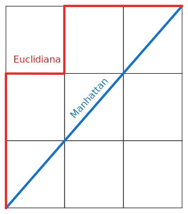
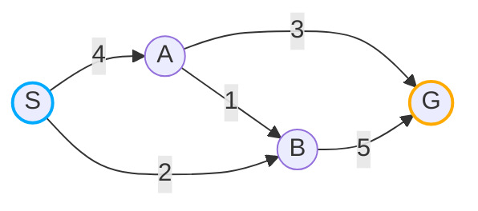
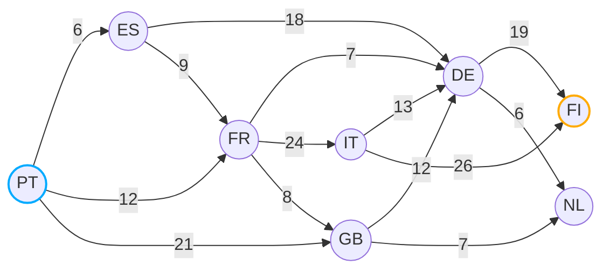

## O que é o Algoritmo de A* (A-Star)?

O **A*** **(A-Star)** é um algoritmo de pesquisa informada que encontra um caminho de custo mínimo em um grafo. Ele utiliza uma heurística para guiar a pesquisa, tornando-o mais eficiente do que métodos de pesquisa não informados, como o algoritmo de **Dijkstra**.
Embora o **A*** compartilhe semelhanças com o algoritmo de **Dijkstra**, sua aplicação principal é encontrar o caminho ótimo entre um ponto inicial e um objetivo específico. Isso faz com que algumas referências não o classifiquem como um algoritmo de **SSSP (Single Source Shortest Path)**.
Uma das características do **A*** é a capacidade de encontrar o caminho mais curto, mesmo na presença de obstáculos no percurso. Se o caminho até o objetivo estiver bloqueado, o **A*** terminará a pesquisa após explorar todos os nós possíveis, concluindo que não existe um caminho válido.


## Aplicabilidade

- Videojogos
- Inteligência artificial - É um dos algoritmos de pesquisa mais importantes na área da inteligência artificial.
- Sistemas de navegação - O **A*** é amplamente utilizado para encontrar rotas eficientes.
- Robótica


## Conceitos importantes do A*

### Lista Aberta

A Lista Aberta contém nós que ainda precisam ser explorados e podem já ter sido visitados, mas ainda não foram processados completamente. Essa lista é atualizada à medida que o algoritmo avança, adicionando novos nós e removendo os nós que já foram explorados. Essa lista também deve ser ordenada com base no valor de `f(n)`. Sabendo que essa lista deve ser ordenada, é comum usar uma **Priority Queue** para implementar a Lista Aberta.

### Lista Fechada

A Lista Fechada contém nós que já foram completamente processados e não precisam ser explorados novamente. Quando um nó é removido da Lista Aberta, ele é adicionado à Lista Fechada. Isso impede que o algoritmo explore o mesmo nó mais de uma vez. A lista fechada é usada para evitar ciclos e garantir que o algoritmo não fique preso em um loop infinito. Sabendo que um nó não deve ser explorado mais que uma vez, é comum usar uma **Hash Table** para no momento de verificar se um nó já foi visitado, a operação seja feita em tempo constante ( O(1) ).

### Heurística

**O que é, na realidade, a tal heurística?**

De forma simplificada, podemos dizer que é um palpite do custo necessário para ir do nó A ao nó B.

**Outra pergunta que pode surgir é: "Mas se estamos à procura do caminho, como conseguimos saber o custo desse palpite?"**

A resposta é simples: não sabemos com certeza. A heurística é apenas uma aproximação, um "chute" inteligente que usamos para tentar encontrar o caminho mais curto. E é justamente essa estimativa que torna o algoritmo **A*** mais eficiente.

**Outra dúvida bastante comum é: "O que devemos considerar ao criar uma heurística?"**

Um exemplo simples: se temos um mapa, sabemos as coordenadas geográficas do ponto de partida e do destino. Com base nisso, podemos usar a distância entre esses dois pontos como heurística. Se estivermos a falar de um jogo de tabuleiro, por exemplo, podemos usar as coordenadas cartesianas dos pontos inicial e final para calcular a distância entre eles.

Agora, de forma mais técnica, o algoritmo **A*** utiliza uma função heurística, representada por `h(n)`, para estimar o custo restante até o objetivo. Isso permite priorizar caminhos promissores e reduzir o número de nós explorados. Essa função é fundamental para guiar a pesquisa de maneira eficiente, pois o conceito do **A*** é explorar primeiro os nós com menor custo estimado para alcançar o objetivo.

```math
f(n) = g(n) + h(n)
```
- `g` é o custo acumulado do nó inicial até o nó `n` nó atual. **(O custo real do caminho)**.
- `h` é o custo estimado do nó `n` nó atual até o nó final. **(A heurística)**.
- `f` é o custo total do nó atual. **(Função de avaliação)**. A função `f(n)` é a função de avaliação que determina a ordem de exploração dos nós. Ela é a soma do custo real `g(n)` e da heurística `h(n)`. O **A*** explora os nós com o menor valor de `f(n)` primeiro.

A função heurística `h(n)` é o que torna o **A*** mais inteligente do que outros algoritmos de pesquisa como o **Dijkstra**, porque ele usa uma estimativa do que falta para chegar ao objetivo. Se essa estimativa for boa, o **A*** encontra o caminho ótimo rapidamente.

É importante notar que o custo pode ser qualquer valor que represente o esforço necessário para se mover de um nó para outro. Assim como a heurística. Por ser a distância entre dois pontos, o tempo, o custo monetário, a quantidade de combustível, a combinação de vários fatores, etc. O importante é termos consciencia de que não é responsabilidade do algoritmo determinar os custos e a heurística. Ele só faz uso delas.

#### Por que usar uma heurística?

- Reduzir o número de nós explorados, tornando a pesquisa mais rápida.
- Priorizar os nós mais promissores, ao invés de explorar todos igualmente.
- Balancear entre pesquisa exata (Dijkstra) e pesquisa gulosa (Greedy Search).

### Heurísticas comuns

- **Distância de Manhattan**: A distância de Manhattan é a distância entre dois pontos em um grid, movendo-se apenas em direções ortogonais (cima, baixo, esquerda, direita). É chamada assim porque representa a distância percorrida em ruas organizadas em grade, como em Manhattan. A distância de Manhattan é uma heurística comum para problemas de pesquisa em um grid.

```math
h(n) = |x2 - x1| + |y2 - y1|
```

- **Distância Euclidiana (ou Distância Direta)**: A distância euclidiana é a distância em linha reta entre dois pontos. Quando precisamos admitir movimentos diagonais, ou os nós são representados por coordenadas no espaço, a distância euclidiana é uma heurística comum.

```math
h(n) = sqrt((x2 - x1)^2 + (y2 - y1)^2)
```



- **Distância de Chebyshev**: A distância de Chebyshev é definida como a maior diferença entre as coordenadas de dois pontos em um grid, permitindo movimentação em qualquer direção (cima, baixo, esquerda, direita, diagonal) com o mesmo custo.

```math
h(n) = max(|x2 - x1|, |y2 - y1|)
```
**Exemplo:**
- x1: (2, 1)
- x2: (4, 6)

```math
h(n) = max(|4 - 2|, |6 - 1|) = max(2, 5) = 5
```

| Heurística                 | Aplicação                                             | Ótima para                                                           |
|----------------------------|-------------------------------------------------------|----------------------------------------------------------------------|
| **Distância de Manhattan** | Movimentos ortogonais (sem diagonais)                 | Grades onde apenas movimentos verticais e horizontais são permitidos |
| **Distância Euclidiana**   | Movimentos livres em qualquer direção                 | Ambientes contínuos ou mapas 2D sem restrições                       |
| **Distância de Chebyshev** | Movimentos ortogonais e diagonais                     | Movimentos em grids, quando diagonais são permitidas                 |


### Heurística admissível vs. Heurística inconsistente

Uma  **heurística é admissível** se, para qualquer nó `n`, `h(n) <= h*(n)`, onde `h*(n)` é o custo real do caminho ótimo de `n` até o objetivo. Isso garante que o **A*** encontre o caminho mais curto, mas não necessariamente de forma eficiente. Podemos então dizer que a função `h(n)` deve ser uma **estimativa otimista** do custo real do caminho e que quanto mais próxima a função `h(n)` for do custo real do caminho, mais eficiente e rápido o algoritmo será.

A admissibilidade **deve ser verificada para todos os nós** do espaço de pesquisa. Isso significa que por exemplo **não basta testar os nós do caminho ótimo**.

Por outro lado, uma **heurística inconsistente** pode superestimar o custo para alcançar o objetivo. Nesse caso, o **A*** não é garantido para encontrar o caminho mais curto, mas ainda pode encontrar um caminho válido.

### Completude

O **A*** é considerado completo quando, ao pesquisar um caminho de um `nó` inicial até um `nó` final em um espaço de pesquisa finito, ele sempre encontra uma solução, se uma solução existir.

Para garantir a completude, o **A*** deve satisfazer algumas condições:
- O espaço de pesquisa deve ser finito – Se o espaço de pesquisa for infinito ou tiver ciclos infinitos, o **A*** pode nunca terminar.
- O fator de ramificação é finito – O número de nós filhos gerados a partir de cada nó deve ser finito.
- O custo de cada ação é maior que zero – Se houver custos negativos ou zero, o algoritmo pode entrar em loops infinitos.
- A heurística `h(n)` é admissível – Ou seja, a heurística nunca pode superestimar o custo real para chegar ao objetivo.

### Consistência

A consistência (também chamada de monotonicidade) é uma propriedade fundamental das heurísticas usadas em algoritmos de pesquisa como o **A***. Ela garante que a estimativa do custo de um nó até o objetivo nunca supera o custo real de um caminho ótimo.

Uma heurística é considerada consistente se, para cada nó `n` e cada sucessor `n'` de `n` gerado por qualquer ação `a`, o custo estimado de alcançar o objetivo a partir de `n` é no máximo o custo real de chegar ao `n'` mais o custo estimado de alcançar o objetivo a partir de `n'`. Em outras palavras, a heurística é consistente se:

```math
h(n) ≤ c(n,n') + h(n')
```
**Onde:**
- `h(n)` é a heurística estimada do custo de `n` até o objetivo.
- `h(n')` é a heurística estimada do custo de `n'` até o objetivo.
- `c(n,n')` é o custo real da transição de `n` para `n'`.
- `a` é a ação que leva de `n` para `n'`.

#### Por que a consistência é importante?
- **Garante a optimalidade**: Se a heurística for consistente, o **A*** reduz significativamente a necessidade de reexpansão de nós, garantindo que o primeiro caminho encontrado seja ótimo.
- **Mantém a ordem crescente do custo**: O valor total do custo `f(n) = g(n) + h(n)` nunca diminui ao longo do caminho, garantindo que o primeiro caminho encontrado seja o melhor.
- **Evita reexpansões desnecessárias**: Isso torna o **A*** mais eficiente, pois não precisa reavaliar nós já processados.
- **Garante a Admissibilidade**: Se uma heurística é consistente, então ela também é admissível, ou seja, nunca superestima o custo real até o objetivo.

#### Ilustração da Consistência vs. Inconsistência

Vamos imagina o seguinte grafo onde `S` é o nó inicial e `G` é o nó objetivo.



**Tabela de heurísticas para chegar ao destino:**
| Nó | `h(n)` Consistente | `h(n)` Não-Consistente |
|----|--------------------|------------------------|
| S  | 3                  | 5                      |
| A  | 2                  | 3                      |
| B  | 4                  | 1                      |
| G  | 0                  | 0                      |

Primeiro vamos explicar em detalhe a formula `h(n) ≤ c(n,n') + h(n')` e para o exemplo vamos imagina no grafo acima o nó `A` e um dos seus sucessores, que no caso seria o nó `B` e vamos usar a tabela de heurísticas consistentes.

- **n** = A -> Nó atual
- **n'** = B -> Nó sucessor
- **h(n)** = 2 -> Heurística do nó atual
- **h(n')** = 4 -> Heurística do nó sucessor
- **c(n,n')** = 1 -> Custo real de `A` até `B`
- `h(n) ≤ c(n,n') + h(n')` -> `2 ≤ 1 + 4` -> `2 ≤ 5` -> Válido ✅

- Com as heurísticas consistentes:
  - **S -> A**: 3 <= 4 + 2 - válido ✅
  - **S -> B**: 3 <= 2 + 4 - válido ✅
  - **A -> G**: 2 <= 3 + 0 - válido ✅
  - **A -> B**: 2 <= 1 + 4 - válido ✅
  - **B -> G**: 4 <= 5 + 0 - válido ✅
- Com as heurísticas não consistentes:
  - **S -> A**: 5 <= 4 + 3 - válido ✅
  - **S -> B**: 5 <= 2 + 1 - inválido ❌
  - **A -> G**: 3 <= 3 + 0 - válido ✅
  - **A -> B**: 3 <= 1 + 1 - inválido ❌
  - **B -> G**: 1 <= 5 + 0 - válido ✅


### Optimalidade

O **A*** é considerado ótimo quando é garantido que encontra o caminho mais curto. O **A*** é garantido para ser ótimo se a heurística `h(n)` for admissível. Se a heurística `h(n)` for inconsistente, o **A*** ainda pode encontrar um caminho válido, mas não é garantido que seja o caminho mais curto.

> **Conclusão:** O **A*** pode ser completo, mas não necessariamente ótimo (caso a heurística seja mal projetada). Porém, se a heurística for admissível e consistente, o **A*** é completo e ótimo.


## Complexidade assintótica

A complexidade de tempo do **A*** pode variar dependendo da heurística escolhida.

#### Caso Pior `O(b^d)` (Heurística ruim ou `h(n) = 0`)

Quando `h(n) = 0`, o **A*** se comporta como o algoritmo de **Dijkstra**, expandindo todos os nós antes de encontrar a solução, resultando em uma complexidade exponencial `O(b^d)`, onde `b` é o fator de ramificação e `d` é a profundidade da solução ótima.

```math
O(b^d)
```

#### Caso Médio `Θ(n)` (Heurística informativa)

Se a heurística `h(n)` for bem projetada e informativa, a complexidade do **A*** pode ser significativamente menor que `O(b^d)`. O comportamento exato depende do espaço de pesquina e da qualidade da heurística. Em alguns casos, a complexidade pode se aproximar de `O(d log d)`, semelhante a um algoritmo de ordenação eficiente, se a heurística reduzir drasticamente o número de nós expandidos. No entanto, no pior caso, ainda pode ser exponencial.

```math
O(b^m)
```
Onde:
- `m` é a profundidade até a melhor solução, mas com um crescimento menor que `O(b^d)`, pois a heurística reduz a quantidade de nós expandidos.

#### Caso Melhor `Ω(n)` (Heurística Perfeita)

Se a heurística `h(n)` for perfeita (ou seja, sempre retorna o custo exato até o objetivo), o **A*** expande apenas os nós no caminho ótimo, resultando em complexidade linear:

```math
O(d)
```

> **Nota:** Se a heurística `h(n) = 0` isto significa que `f(n) = g(n) + h(n)` é igual a `f(n) = g(n)`, ou seja, o **A*** se comporta como o algoritmo de Dijkstra. E nesse caso, o **Dijkstra** pode ser uma melhor solução devido ao maior consumo de memória do **A***.


## Como funciona o Algoritmo de A*?

### Passo a Passo Teórico

#### Representação em Grafo

Vamos imaginar que temos o seguinte grafo que representa um mapa e a ligação entre os vários países. O objetivo é encontrar o caminho mais curto de Portugal (PT) até a Finlândia (FI).



**Tabela de heurísticas para chegar ao destino:**

| Origem | Cidade      | `h(n)` |
|--------|-------------|--------|
| PT     | Portugal    | 27     |
| ES     | Espanha     | 19     |
| FR     | França      | 25     |
| GB     | Reino Unido | 10     |
| NL     | Holanda     | 26     |
| DE     | Alemanha    | 19     |
| IT     | Itália      | 23     |
| FI     | Finlândia   | 0      |

**Passo 1:**

Inicializar a Lista Aberta (Open List) e a Lista Fechada (Closed List). Adicionar o nó inicial na Open List com `f(n) = 0`. Neste caso, o nó inicial é `PT`.

```plaintext
Open List:
  PT[27, 0, -]

Closed List:
  Vazia
```

**Passo 2:**

Agora vamos buscar o nó que tem o menor valor de `f(n)` na Open List. Neste caso, o nó `PT` é o único nó na Open List e removemos ele da lista. E verificamos se é o nó objetivo. Neste caso, não será, então adicionamos o nó `PT` na Closed List e geramos os sucessores de `PT`.


```plaintext
Open List:
  Vazia

Closed List:
  PT[27, 0, -]
```

**Passo 3:**

Gerar os sucessores de `PT` e definir `PT` como o pai de cada um deles. Para cada sucessor, calcular os valores de custo `g(n)`, `h(n)` e `f(n)`.
Se um nó com a mesma posição do sucessor já estiver na Open List com um menor valor de `f`, ignorar este sucessor. Se um nó com a mesma posição do sucessor já estiver na Closed List com um menor valor de `f`, ignorar este sucessor. Caso contrário, adicionar o sucessor à Open List de forma ordenada.

- ES: g = (0 + 6) = 6, h = 19, f = 25
- FR: g = (0 + 12) = 12, h = 25, f = 37
- GB: g = (0 + 21) = 21, h = 10, f = 31


```plaintext
Open List:
  ES[25, 6, PT]
  GB[31, 21, PT]
  FR[37, 12, PT]

Closed List:
  PT[27, 0, -]
```

**Passo 4:**

Vamos verificar o próximo nó com o menor valor de `f(n)` na Open List. Neste caso, o nó `ES` é o nó com o menor valor de `f(n)`. Removemos o nó `ES` da Open List e verificamos se é o nó objetivo. Neste caso, não será, então adicionamos o nó `ES` na Closed List e geramos os sucessores de `ES`.

- DE: g = (6 + 18) = 24, h = 19, f = 43
- FR: g = (6 + 9) = 15, h = 25, f = 40

Neste passo, verificamos que o nó `FR` já está na Open List com um valor de `f` menor, então ignoramos o nó `FR`. No entanto, o nó `DE` não está na Open List, então adicionamo-lo.

```plaintext
Open List:
  GB[31, 21, PT]
  FR[37, 12, PT]
  DE[43, 24, ES]

Closed List:
  PT[27, 0, -]
  ES[25, 6, PT]
```

**Passo 5:**

O próximo nó com o menor valor na Open List é o `GB` que tem `f(n) = 31`. Também não é o nó objetivo, então adicionamos o nó `GB` na Closed List e geramos os sucessores de `GB`.

- DE: g = (21 + 12) = 33, h = 19, f = 52
- NL: g = (21 + 7) = 28, h = 26, f = 54

Agora verificamos que o nó `DE` também já está na Open List com um valor de `f(n) = 43` menor, então ignoramos o nó `DE`. No entanto, o nó `NL` não está na Open List, então adicionamo-lo.

```plaintext
Open List:
  FR[37, 12, PT]
  DE[43, 24, ES]
  NL[54, 28, GB]

Closed List:
  PT[27, 0, -]
  ES[25, 6, PT]
  GB[31, 21, PT]
```

**Passo 6:**

O próximo nó com o menor valor é o `FR` que tem `f(n) = 37`. Também não é o nó objetivo, então adicionamos o nó `FR` na Closed List e geramos os sucessores de `FR`.

- DE: g = (12 + 7) = 19, h = 19, f = 38
- IT: g = (12 + 24) = 36, h = 23, f = 59
- GB: g = (12 + 8) = 20, h = 10, f = 30

Neste passo temos algumas situações novas:

- O nó `DE` já está na Open List, mas desta vez o novo valor de `f(n) = 38` é menor, então atualizamos o valor de `f(n)` para `38`.
- O nó `IT` não está na Open List, então adicionamo-lo nem na Closed List.
- O nó `GB` também já está na Closed List, mas desta vez o novo valor de `f(n) = 30` é menor, então removemos o nó `GB` da Closed List e adicionamos ele na Open List novamente.

```plaintext
Open List:
  GB[30, 20, FR]
  DE[38, 19, FR]
  NL[54, 28, GB]
  IT[59, 36, FR]

Closed List:
  PT[27, 0, -]
  ES[25, 6, PT]
  FR[37, 12, PT]
```

**Passo 7:**

O próximo nó com o menor valor é o `GB` que tem `f(n) = 30`. Também não é o nó objetivo, então adicionamos o nó `GB` na Closed List e geramos os sucessores de `GB`.

- DE: g = (20 + 12) = 32, h = 19, f = 51
- NL: g = (20 + 7) = 27, h = 26, f = 53

Neste passo temos as seguintes situações:

- O nó `DE` já está na Open List, mas desta vez o novo valor de `f(n) = 51` é maior, então ignoramos o nó `DE`.
- O nó `NL` já está na Open List, mas desta vez o novo valor de `f(n) = 53` é menor, então atualizamos o valor de `f(n)` para `53`.

```plaintext
Open List:
  DE[38, 19, FR]
  NL[53, 27, GB]
  IT[59, 36, FR]

Closed List:
  PT[27, 0, -]
  ES[25, 6, PT]
  FR[37, 12, PT]
  GB[30, 20, FR]
```

**Passo 8:**

O próximo nó com o menor valor é o `DE` que tem `f(n) = 38`. Também não é o nó objetivo, então adicionamos o nó `DE` na Closed List e geramos os sucessores de `DE`.

- FI: g = (19 + 19) = 38, h = 0, f = 38
- NL: g = (19 + 6) = 25, h = 26, f = 51

Neste passo temos as seguintes situações:

- O nó `FI` não está na Open List nem na Closed List, então adicionamo-lo.
- O nó `NL` já está na Open List, mas desta vez o novo valor de `f(n) = 51` é menor, então atualizamos o valor de `f(n)` para `51`.

```plaintext
Open List:
  FI[38, 38, DE]
  NL[53, 27, GB]
  IT[59, 36, FR]

Closed List:
  PT[27, 0, -]
  ES[25, 6, PT]
  FR[37, 12, PT]
  GB[30, 20, FR]
  DE[38, 19, FR]
```

**Passo 9:**

O próximo nó com o menor valor é o `FI` que tem `f(n) = 38`. E neste caso, o nó `FI` é o nó objetivo, então adicionamos o nó `FI` na Closed List e encerramos a pesquisa.

Temos o seguinte caminho ótimo: de `PT` até `FI` é `PT -> FR -> DE -> FI` com um custo total de `38`.


### Pseudocódigo

```plaintext
1. Inicializar a Lista Aberta (Open List)
2. Inicializar a Lista Fechada (Closed List)
  2.1 Adicionar o nó inicial na Open List (com f(n) = 0 )
3. Enquanto a Open List não estiver vazia, faça:
  3.1. Encontrar o nó com o menor valor de f na Open List, chamá-lo de q
  3.2. Remover q da Open List
  3.3. Gerar os sucessores de q e definir q como o pai de cada um deles
  3.4. Para cada sucessor:
    3.4.1. Se o sucessor for o nó objetivo, encerrar a pesquisa
    3.4.2. Caso contrário, calcular os valores de custo:
      3.4.2.1. g(n) do sucessor: g = gq + distância entre q e o sucessor
      3.4.2.2. h(n) do sucessor: distância heurística do sucessor até o objetivo
      3.4.2.3. f(n) do sucessor: f(n) = g(n) + h(n)
    3.4.3. Se um nó com a mesma posição do sucessor já estiver na Open List com um menor valor de f, ignorar este sucessor
    3.4.4. Se um nó com a mesma posição do sucessor já estiver na Closed List com um menor valor de f, ignorar este sucessor
    3.4.5. Caso contrário, adicionar o sucessor à Open List
  3.5. Adicionar q à Closed List
4. Fim do loop
```

### Implementação em Python

```python
import heapq
from collections import defaultdict

def a_star(start, goal, graph, heuristics):
  # For the open list, we use a heap queue to store the nodes with the lowest f(n) value at the top (priority queue)
  # ( f(n), node, path, g(n) )
  open_list = []
  heapq.heappush(open_list, (heuristics[start], start, 0, [start]))

  close_list = defaultdict(lambda: float('inf'))

  while open_list:
    # Pop the node with the lowest f(n) from the open list
    _, current, g_cost_parent, path = heapq.heappop(open_list)

    # If the current node is the goal, we return the path and the cost
    if current == goal:
        return path, g_cost_parent

    close_list[current] = g_cost_parent

    # Explore the neighbors of the current node
    for neighbor, move_cost in graph.get(current, {}).items():
      g_score = g_cost_parent + move_cost

      f_cost_closed = close_list[neighbor]
      if g_score < f_cost_closed:
        heuristic = heuristics[neighbor]
        f_cost = g_score + heuristic
        # Create the path to the neighbor
        path = path + [neighbor]
        heapq.heappush(open_list, (f_cost, neighbor, g_score, path))

  # No path found
  return None


heuristics = {
  "PT": 27,
  "ES": 19,
  "FR": 25,
  "GB": 10,
  "NL": 26,
  "DE": 19,
  "IT": 23,
  "FI": 0
}

graph = {
  'PT': { 'ES': 6, 'FR': 12, 'GB': 21 },
  'ES': { 'DE': 18, 'FR': 9 },
  'FR': { 'DE': 7, 'IT': 24, 'GB': 8 },
  'GB': { 'DE': 12, 'NL': 7 },
  'IT': { 'DE': 13, 'FI': 26 },
  'DE': { 'FI': 19, 'NL': 6 }
}

path, cost = a_star("PT", "FI", graph, heuristics)

print(f'Path: {" > ".join(path)}')
print(f'Cost: {cost}')
```

[Veja o código em execução aqui](https://github.com/NelsonBN/algorithms-data-structures-a-star/blob/main/src/a-start-graph.py)


## Variações do Algoritmo de A*

- JPS (Jump Point Search)
- D (Dynamic A*)
- IDA* (Iterative Deepening A*)
- WA* (Weighted A*)


## Referências

- [Wikipedia](https://en.wikipedia.org/wiki/A*_search_algorithm)
- [GeeksforGeeks](https://www.geeksforgeeks.org/a-search-algorithm/)
- [Euclidean distance](https://en.wikipedia.org/wiki/Euclidean_distance)
- [Manhattan distance](https://simple.wikipedia.org/wiki/Manhattan_distance)
- [Chebyshev distance](https://en.wikipedia.org/wiki/Chebyshev_distance)
- [Diagonal distance](https://theory.stanford.edu/~amitp/GameProgramming/Heuristics.html#diagonal-distance)
