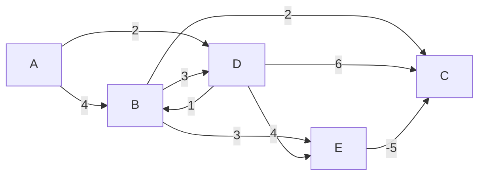
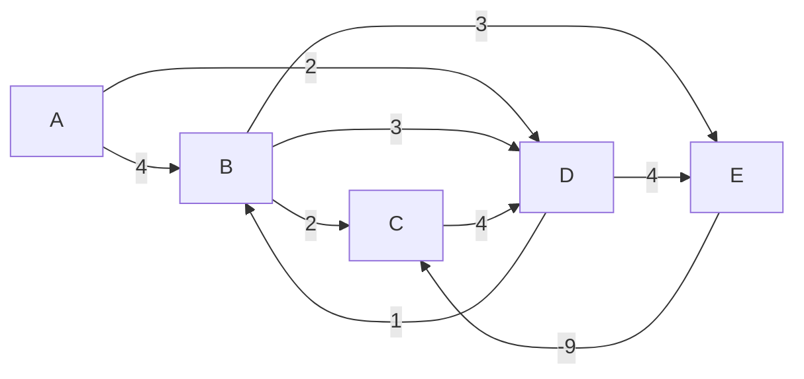

## O que é o Algoritmo de Bellman-Ford?

O Algoritmo de Bellman-Ford é utilizado para encontrar o caminho mais curto a partir de uma única fonte em um grafo ponderado. Diferentemente do algoritmo de Dijkstra, ele pode lidar com pesos negativos nas arestas.


## Origem e História

O algoritmo foi inicialmente proposto por Alfonso Shimbel em 1955. Posteriormente, Richard Bellman e Lester R. Ford Jr. publicaram versões independentes do algoritmo em 1958 e 1956, respectivamente. Em 1959, Edward F. Moore também publicou uma variação do algoritmo, razão pela qual ele é, por vezes, denominado Algoritmo de Bellman-Ford-Moore.

Bellman, conhecido por desenvolver o conceito de programação dinâmica, aplicou essa técnica ao algoritmo, permitindo a resolução de problemas de otimização ao decompor problemas complexos em subproblemas mais simples.


## Características

O algoritmo se encaixa nas seguintes categorias:

* **Algoritmo de Grafos:** Resolve o problema relacionado ao caminho mais curto a partir de uma única fonte.
* **Algoritmo de Programação Dinâmica:** Utiliza a ideia de subproblemas sobrepostos para calcular a menor distância de um vértice até todos os outros.


## Para que serve?

O Algoritmo de Bellman-Ford resolve o problema do caminho mínimo em grafos ponderados, mesmo quando existem **pesos negativos**. Além disso, ele pode detectar ciclos negativos, tornando-se essencial em diversas aplicações.


## Principais aplicações

* **Redes de Computadores:** Utilizado no Routing Information Protocol (RIP) para calcular rotas mais eficientes.
* **Logística e Transporte:** Planejamento de trajetos e otimização de custos de transporte.
* **Finanças:** Modelagem de arbitragem e identificação de inconsistências em taxas de câmbio.


## Quando usar?

O Bellman-Ford é a escolha certa quando:

* **Pesos negativos estão presentes:** Diferente do Dijkstra, ele funciona corretamente mesmo com pesos negativos.
* **É necessário detectar ciclos negativos:** Importante em cálculos financeiros e redes de fluxo.
* **O número de arestas não é muito grande:** O algoritmo tem complexidade O(V × E), então é eficiente quando o grafo não é muito denso.
Se o grafo não possui pesos negativos e exige uma solução mais rápida, Dijkstra pode ser uma opção melhor.


## Bellman-Ford vs. Dijkstra

| **Critério**                     | **Bellman-Ford**                                                | **Dijkstra**                                         |
|----------------------------------|-----------------------------------------------------------------|------------------------------------------------------|
| **Pesos negativos**              | ✅ Funciona corretamente                                        | ❌ Não funciona                                      |
| **Detecção de ciclos negativos** | ✅ Sim                                                          | ❌ Não                                               |
| **Complexidade**                 | `O(V × E)`                                                      | `O(V log V + E)` (com heap)                          |
| **Melhor para**                  | Grafos com pesos negativos ou necessidade de detecção de ciclos | Grafos sem pesos negativos, onde rapidez é essencial |

**Conclusão**: Use **Dijkstra** para eficiência quando **não houver pesos negativos**. Escolha **Bellman-Ford** se precisar lidar com **pesos negativos ou detectar ciclos negativos**.


## Conceitos fundamentais

Antes de entender o funcionamento do **Algoritmo de Bellman-Ford**, é essencial conhecer alguns conceitos-chave sobre **grafos e caminhos mínimos**.

### Grafos Direcionados e Não-Direcionados

- Um **grafo direcionado** possui **arestas com direção**, ou seja, uma conexão **A → B** não significa que existe **B → A**.
- Um **grafo não-direcionado** possui conexões **bidirecionais** (A ↔ B).
- O **Bellman-Ford** pode ser aplicado a ambos, mas em **grafos não-direcionados** com pesos negativos, pode haver **ciclos negativos triviais**, tornando a solução indefinida.

### Pesos nas arestas (Positivos e Negativos)

- Cada aresta em um grafo tem um **peso** (ou custo), representando distância, tempo, custo financeiro ou qualquer outra métrica que represente o custo de se mover de um vértice para outro. O que chamamos de **Grafo Ponderado**.
- O **Dijkstra falha com pesos negativos**, pois assume que encontrar um caminho ótimo mais curto significa apenas **somar pesos**.
- O **Bellman-Ford resolve esse problema**, permitindo caminhos mínimos **mesmo em grafos com pesos negativos**.

### O conceito de relaxamento de arestas

- O **relaxamento** é o processo central do Bellman-Ford. O algoritmo **atualiza repetidamente a menor distância conhecida** para cada vértice, garantindo que o caminho mínimo seja encontrado ao longo do tempo.
- Se uma aresta **(U → V, peso W)** puder reduzir a distância para **V**, a atualização ocorre:

```math
dist(V) = min(dist(V), dist(U) + W)
```

### Detectando ciclos negativos

- Se, após **V-1 iterações**, ainda houver uma **atualização possível**, significa que existe um **ciclo negativo**, ou seja, um caminho em que a soma dos pesos das arestas é negativa.
- Isso causa um problema, pois significaria que o caminho poderia ser sempre reduzido indefinidamente


## Funcionamento

Agora que entendemos os conceitos fundamentais, vamos ver como o **algoritmo funciona na prática**.

1. **Inicializar Distâncias:**
   1. Definir um vértice de origem **S** e inicializar todas as distâncias como **infinito (∞)**, exceto o nó de origem, que recebe 0.
2. **Relaxar Todas as Arestas V−1 Vezes:**
   1. Para cada **aresta (u → v, peso w)**, atualizar a distância para **V** se encontrar um caminho mais curto via **U**.
   2. Repetir esse processo **V-1** vezes (onde V é o número de vértices), garantindo que todas as possíveis melhorias sejam feitas.
3. **Verificar Ciclos Negativos**
   1. Percorrer todas as arestas novamente.
   2. Se alguma aresta **ainda puder ser relaxada**, significa que há um **ciclo negativo** no grafo.

### Passo a Passo Teórico

A seguir, apresentamos um exemplo prático da execução do **Algoritmo de Bellman-Ford** usando um grafo direcionado e ponderado.



#### Passo 1:

Semelhante ao algoritmo de Dijkstra, usaremos uma **tabela de distâncias** para rastrear os caminhos mais curtos. Teremos **uma linha para cada iteração** e **uma coluna para cada vértice**.

O número de iterações do **Bellman-Ford** é igual ao **número de vértices menos um**:

```math
it = V-1
```

|       | A | B | C | D | E |
|-------|---|---|---|---|---|
| 1ª It |   |   |   |   |   |
| 2ª It |   |   |   |   |   |
| 3ª It |   |   |   |   |   |
| 4ª It |   |   |   |   |   |

Agora escolhemos o **vértice de origem**. Para este exemplo, vamos definir **A** como o ponto de partida.

#### Passo 2

Inicializamos a tabela preenchendo a **distância a partir do vértice A** para os outros vértices.
A forma de representação será `(<Custo>, <Origem>)` e, caso o caminho seja impossível, indicamos `-`.

|       | A      | B      | C | D      | E |
|-------|--------|--------|---|--------|---|
| 1ª It | (0, A) | (4, A) | - | (2, A) | - |
| 2ª It |        |        |   |        |   |
| 3ª It |        |        |   |        |   |
| 4ª It |        |        |   |        |   |

Após a **primeira iteração**, conseguimos chegar até:

- **A** com o custo **0**;
- **B** com o custo **4**;
- **D** com o custo **2**.

#### Passo 3

Agora aplicamos o **relaxamento de arestas** baseado nas seguintes regras:

1. **Se um novo vértice for acessível**, somamos o custo da aresta ao custo do vértice anterior.
2. **Se já acessamos um vértice anteriormente**, verificamos se um **novo caminho reduz o custo**. Caso sim, atualizamos o valor (relaxamento).
3. **Se nenhum novo caminho foi descoberto**, propagamos o custo da iteração anterior.

Exemplo de atualizações:

- **B**: Um novo caminho é descoberto passando por **D** → **B** com custo **(2 + 1) = 3**. Como **3 é menor que 4**, atualizamos o custo.
- **D**: Já foi alcançado na iteração anterior, então permanece com custo **2**.
- **C**: Pode ser acessado por **B → C (4 + 2 = 6)** ou **D → C (2 + 6 = 8)**. O menor custo é **6** via **B**.
- **E**: Pode ser acessado por **B → E (4 + 3 = 7)** ou **D → E (2 + 4 = 6)**. O menor custo é **6** via **D**.

|       | A      | B      | C      | D      | E      |
|-------|--------|--------|--------|--------|--------|
| 1ª It | (0, A) | (4, A) | -      | (2, A) | -      |
| 2ª It | (0, A) | (3, D) | (6, B) | (2, A) | (6, D) |
| 3ª It |        |        |        |        |        |
| 4ª It |        |        |        |        |        |

#### Passo 4

Nesta iteração, observamos uma **nova possibilidade para C**:

- **C** agora pode ser acessado por **E → C (6 + (-5) = 1)**. Como **1 é menor que 6**, atualizamos o custo.
- **E** continua com **custo 6**, pois não há caminho melhor.

|       | A      | B      | C      | D      | E      |
|-------|--------|--------|--------|--------|--------|
| 1ª It | (0, A) | (4, A) | -      | (2, A) | -      |
| 2ª It | (0, A) | (3, D) | (6, B) | (2, A) | (6, D) |
| 3ª It | (0, A) | (3, D) | (1, E) | (2, A) | (6, D) |
| 4ª It |        |        |        |        |        |

#### Passo 5

- Nenhuma nova atualização ocorre.
- Propagamos os valores da terceira iteração.

|       | A      | B      | C      | D      | E      |
|-------|--------|--------|--------|--------|--------|
| 1ª It | (0, A) | (4, A) | -      | (2, A) | -      |
| 2ª It | (0, A) | (3, D) | (6, B) | (2, A) | (6, D) |
| 3ª It | (0, A) | (3, D) | (1, E) | (2, A) | (6, D) |
| 4ª It | (0, A) | (3, D) | (1, E) | (2, A) | (6, D) |

Após essa iteração, os menores caminhos foram determinados:

- **A → A** = **0**
- **A → B** = **3** (A → D → B)
- **A → C** = **1** (A → D → E → C)
- **A → D** = **2** (A → D)
- **A → E** = **6** (A → D → E)

### **Detecção de Ciclo Negativo**

Agora, introduzimos um **grafo com ciclo negativo** para ilustrar sua detecção.



Após **V-1 iterações**, fazemos uma **iteração extra**:

|       | A      | B      | C      | D      | E       |
|-------|--------|--------|--------|--------|---------|
| 1ª It | (0, A) | (4, A) | -      | (2, A) | -       |
| 2ª It | (0, A) | (3, D) | (6, B) | (2, A) | (6, D)  |
| 3ª It | (0, A) | (3, D) | (-3, E) | (2, A) | (6, D) |
| 4ª It | (0, A) | (3, D) | (-3, E) | (1, C) | (6, D) |
| Extra | (0, A) | (2, D) | (-4, E) | (0, C) | (5, D) |

Como **há mudança na iteração extra**, detectamos um **ciclo negativo**.


## Complexidade Assintótica

A eficiência de um algoritmo é medida pela sua **complexidade assintótica**, que nos dá uma ideia de seu desempenho conforme o número de **vértices (V)** e **arestas (E)** do grafo cresce.

### **Pior Caso: O(V x E)**

- O algoritmo executa o **relaxamento de todas as arestas V−1 vezes** no pior caso. Como há **E arestas**, o total de operações será:

```math
O( (V−1) ×E ) = O(V × E)
```

- Esse pior caso acontece quando o grafo **não está otimizado** e cada relaxamento melhora uma distância, exigindo todas as iterações.


## Desafios e Limitações

- **Tempo de Execução**: Com complexidade `O(V x E)`, Bellman-Ford pode ser **lento em grafos grandes**.
- **Não é eficiente para grafos sem pesos negativos**: O **Dijkstra** é uma alternativa mais eficiente quando não há pesos negativos.
- **Ciclos Negativos podem tornar a solução inválida**: Se um ciclo negativo for detectado, o algoritmo informa sua existência, mas **não pode calcular caminhos mínimos confiáveis**, pois o custo pode ser reduzido indefinidamente.


## Possíveis Otimizações

- **Encerramento antecipado**: Se nenhuma aresta for relaxada em uma iteração, o algoritmo pode ser encerrado antes de completar **V-1** iterações.
- **Versão otimizada com fila (SPFA - Shortest Path Faster Algorithm)**: Usa uma **fila** para processar apenas os vértices que podem ser melhorados, reduzindo o número de relaxamentos.
