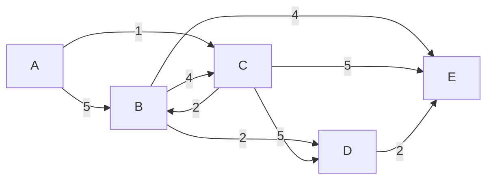

> Este artigo foi escrito baseado em nossas discussões no encontro da comunidade focado no Algoritmo de Dijkstra, que ocorreu dia 21 de Janeiro de 2025.
> Para assistir acesse: [Encontro da Comunidade - Algoritmo de Dijkstra Explicado](https://youtu.be/b4kWEWtCVzA?si=SGQi2ewSz8tVZf7_)

## O que é o Algoritmo de Dijkstra?

O algoritmo de Dijkstra é um método determinístico e guloso (greed) utilizado para resolver o problema de **SSSP (Single Source Shortest Path)**, ou seja, encontrar o caminho mais curto de um nó de origem para um nó destino ou para todos os outros nós em um grafo. Esse algoritmo é amplamente aplicado em problemas de redes, transporte e sistemas de navegação e distribuição.

## Como funciona?

O algoritmo segue uma abordagem gulosa (greed), expandindo os nós do grafo com base nos menores custos acumulados a partir do nó de origem. Isso garante que os caminhos mais curtos para os nós sejam calculados de forma eficiente. Ele explora os vértices de forma iterativa, que em certo ponto se assemelha ao BFS, porém sempre escolhendo o nó com a menor distância acumulada.

## Para que serve?

Dijkstra é utilizado para determinar o menor caminho em grafos ponderados e direcionados ou não direcionados. Aplicações típicas incluem:

- Roteamento em redes de computadores.
- Sistemas de navegação GPS.
- Planejamento de rotas em mapas.

## Origem e História

O algoritmo foi criado por **Edsger Wybe Dijkstra** em 1956 e publicado oficialmente em 1959. É uma das contribuições mais importantes de Dijkstra para a ciência da computação, consolidando sua relevância na resolução de problemas complexos.

## Curiosidade

Edsger Dijkstra foi uma figura central no desenvolvimento de conceitos de programação e algoritmos. Ele é lembrado não apenas por este algoritmo, mas também por contribuições à ciência da computação teórica, como estruturas de controle e verificação formal de software.

## Fundamentos

### O que são grafos ponderados?

Um grafo ponderado é uma estrutura de dados composta por vértices (ou nós) e arestas, onde cada aresta possui um peso associado. Esses pesos podem representar distâncias, custos ou qualquer métrica que conecte dois nós. Por exemplo:

- Em um mapa, os pesos podem representar a distância entre cidades.
- Em uma rede de computadores, os pesos podem ser o tempo de latência entre servidores.

Além disso, os pesos podem ser valores compostos, calculados a partir da combinação de diferentes indicadores ou métricas. Por exemplo, em um sistema de logística, o peso de uma aresta pode representar o custo total de uma rota, levando em conta fatores como distância, tempo de transporte e custo de combustível. Esses valores compostos são úteis para modelar problemas complexos onde múltiplos critérios influenciam a escolha do caminho.

É importante destacar que o algoritmo de Dijkstra não é responsável por calcular esses valores. Ele trabalha diretamente com os pesos fornecidos como entrada, assumindo que já representam as métricas ou combinações desejadas. A responsabilidade de definir ou calcular os pesos cabe ao contexto da aplicação que utiliza o algoritmo.

### Limitações com pesos negativos

O algoritmo de Dijkstra não funciona corretamente em grafos que possuem pesos negativos nas arestas. Isso ocorre porque o algoritmo assume que, ao marcar um nó como processado, sua menor distância já foi encontrada. Com pesos negativos, essa suposição pode ser violada. Para lidar com esses casos, é mais adequado usar o algoritmo de Bellman-Ford, o qual falaremos em breve em um encontro focado nele e também um artigo apenas para ele.

### Grafos direcionados ou não direcionados

O algoritmo funciona tanto em grafos direcionados quanto em não direcionados. No caso de grafos direcionados, as arestas têm uma direção, ou seja, o caminho é válido apenas em um sentido. Em grafos não direcionados, as arestas podem ser percorridas em ambas as direções.

## Estruturas de Dados Utilizadas

### Hashmap / Dicionário

Um dicionário é usado para armazenar as menores distâncias encontradas até cada nó. Cada chave representa um nó, e o valor associado é a distância acumulada a partir do nó de origem. Essa estrutura é eficiente para acessos e atualizações, ambos essenciais para o algoritmo.
Caso precisemos montar o menor caminho, podermos utilizar esta estrutura para também salvar os nós anteriores crrespondentes a cada nó.

### Min-Heap / Priority Queue (ou fila de prioridade)

O heap é utilizado para gerenciar os nós que ainda precisam ser processados, priorizando aquele com a menor distância acumulada. A eficiência do heap reduz o tempo de execução do algoritmo, tornando-o O((V + E) log V), onde V é o número de vértices e E é o número de arestas.

## Representação de Grafos

A escolha da representação do grafo impacta a eficiência do algoritmo. Três representações comuns são:

### Lista de adjacências

É a mais usada em conjunto com o algoritmo de Dijkstra. Cada nó possui uma lista de pares que indicam os nós vizinhos e os pesos das arestas que os conectam. É eficiente em termos de espaço para grafos esparsos.
Neste caso, o algoritmo tira bastante vantagem do uso de uma lista de adjacências, pois casa muito bem com o padrão de consultas que faremos, sempre buscando as edges de um determinado nó.

### Lista de arestas

Armazena todas as arestas do grafo como uma lista de trios (nó de origem, nó de destino, peso). Embora simples, não é eficiente para buscas ou atualizações frequentes.

### Matriz de adjacência

Representa o grafo como uma matriz 2D, onde a posição (i, j) contém o peso da aresta entre os nós i e j. É eficiente para buscas diretas, mas consome mais memória, especialmente para grafos esparsos.

## O Algoritmo em Si

### Passo a Passo Teórico



Uma maneira fácil de explicar o algoritmo de Dijkstra é usar uma tabela para acompanhar a menor distância do nó inicial a cada nó do grafo. Para este exemplo, usaremos o grafo acima.

**Passo 1**

Crie uma tabela com um número de colunas igual ao número de nós no grafo e um número de linhas igual ao número de iterações necessárias para completar o algoritmo. Como o número de iterações é igual ao número de nós no grafo, teremos uma tabela com 5 linhas e 5 colunas.

|         | A   | B   | C   | D   | E   |
| ------- | --- | --- | --- | --- | --- |
| 1º It() |     |     |     |     |     |
| 2º It() |     |     |     |     |     |
| 3º It() |     |     |     |     |     |
| 4º It() |     |     |     |     |     |
| 5º It() |     |     |     |     |     |

**Passo 2**

Primeiro, precisamos selecionar o nó inicial. Neste caso, usaremos o nó 'A' como ponto de partida. Assim, colocaremos o símbolo 'A' na coluna de iteração para indicar que o nó inicial é 'A'. Também colocaremos o número 0 na coluna correspondente ao nó 'A', indicando que a menor distância do nó inicial para ele mesmo é 0, e o nó predecessor para alcançar 'A' é ele próprio (0, A).

|          | A     | B   | C   | D   | E   |
| -------- | ----- | --- | --- | --- | --- |
| 1º It(A) | (0,A) |     |     |     |     |
| 2º It()  |       |     |     |     |     |
| 3º It()  |       |     |     |     |     |
| 4º It()  |       |     |     |     |     |
| 5º It()  |       |     |     |     |     |

**Passo 3**

O primeiro princípio do algoritmo de Dijkstra é que, quando estamos iterando sobre um nó, já determinamos a menor distância do nó inicial até o nó atual. Assim, podemos considerar este nó como imutável, o que equivale a marcá-lo como visitado. Para indicar isso, preencheremos toda a coluna do nó com a mesma distância e nó predecessor '(0, A)'.

|          | A     | B   | C   | D   | E   |
| -------- | ----- | --- | --- | --- | --- |
| 1º It(A) | (0,A) |     |     |     |     |
| 2º It()  | (0,A) |     |     |     |     |
| 3º It()  | (0,A) |     |     |     |     |
| 4º It()  | (0,A) |     |     |     |     |
| 5º It()  | (0,A) |     |     |     |     |

**Passo 4**

Agora, calcularemos a distância para os nós restantes:
* A -> B = 5
* A -> C = 1
* A -> D = Infinito
* A -> E = Infinito

Observe que a distância de A para D e E é Infinito porque não há caminho direto de A para D ou E.

|          | A     | B     | C     | D   | E   |
| -------- | ----- | ----- | ----- | --- | --- |
| 1º It(A) | (0,A) | (5,A) | (1,A) |  ∞  |  ∞  |
| 2º It()  | (0,A) |       |       |     |     |
| 3º It()  | (0,A) |       |       |     |     |
| 4º It()  | (0,A) |       |       |     |     |
| 5º It()  | (0,A) |       |       |     |     |

**Passo 5**

Finalizada a iteração sobre o nó 'A', precisamos selecionar o próximo nó a iterar. Para isso, escolhemos o nó com a menor distância acumulada até o momento. Neste caso, o nó é 'C', com distância acumulada de 1. Em seguida, repetiremos o passo 2 para identificar o nó atual e a distância para si mesmo.

|          | A     | B     | C     | D   | E   |
| -------- | ----- | ----- | ----- | --- | --- |
| 1º It(A) | (0,A) | (5,A) | (1,A) |  ∞  |  ∞  |
| 2º It(C) | (0,A) |       | (1,A) |     |     |
| 3º It()  | (0,A) |       |       |     |     |
| 4º It()  | (0,A) |       |       |     |     |
| 5º It()  | (0,A) |       |       |     |     |

**Passo 6**

Repita o Passo 3 para marcar o nó 'C' como visitado, pois já determinamos a menor distância do nó inicial até ele.

|          | A     | B     | C     | D   | E   |
| -------- | ----- | ----- | ----- | --- | --- |
| 1º It(A) | (0,A) | (5,A) | (1,A) |  ∞  |  ∞  |
| 2º It(C) | (0,A) |       | (1,A) |     |     |
| 3º It()  | (0,A) |       | (1,A) |     |     |
| 4º It()  | (0,A) |       | (1,A) |     |     |
| 5º It()  | (0,A) |       | (1,A) |     |     |

**Passo 7**

Agora, calcule a distância para os nós restantes, somando a distância acumulada à distância do nó atual para os nós vizinhos. Por exemplo:

* C -> B = 2 + (1,A) = 3 -> min(3, (5,A) ) = 3
* C -> D = 5 + (1,A) = 6
* C -> E = 5 + (1,A) = 6

Quando encontramos um nó com uma distância previamente calculada, precisamos comparar a distância anterior com a nova distância calculada (distância acumulada + distância do nó atual para o nó vizinho) e selecionar a menor distância. Isso significa que, se a nova distância for menor que a distância anterior, precisamos atualizar a distância e o nó predecessor.

|          | A     | B     | C     | D     | E     |
| -------- | ----- | ----- | ----- | ----- |------ |
| 1º It(A) | (0,A) | (5,A) | (1,A) |   ∞   |   ∞   |
| 2º It(C) | (0,A) | (3,C) | (1,A) | (6,C) | (6,C) |
| 3º It()  | (0,A) |       | (1,A) |       |       |
| 4º It()  | (0,A) |       | (1,A) |       |       |
| 5º It()  | (0,A) |       | (1,A) |       |       |

**Passo 8**

Continue o processo até que todos os nós tenham sido visitados. Em seguida, selecione o nó 'B':

B -> D = 2 + (3,C) = 5 -> min(5, (6,C) ) = 5
B -> E = 4 + (3,C) = 7 -> min(7, (6,C) ) = 6

|          | A     | B     | C     | D     | E     |
| -------- | ----- | ----- | ----- | ----- |------ |
| 1º It(A) | (0,A) | (5,A) | (1,A) |   ∞   |   ∞   |
| 2º It(C) | (0,A) | (3,C) | (1,A) | (6,C) | (6,C) |
| 3º It(B) | (0,A) | (3,C) | (1,A) | (5,B) | (6,C) |
| 4º It()  | (0,A) | (3,C) | (1,A) |       |       |
| 5º It()  | (0,A) | (3,C) | (1,A) |       |       |

**Passo 9**

Em seguida, selecione o nó 'D':

D -> E = 2 + (5,B) = 7 -> min(7, (6,C) ) = 6

|          | A     | B     | C     | D     | E     |
| -------- | ----- | ----- | ----- | ----- |------ |
| 1º It(A) | (0,A) | (5,A) | (1,A) |   ∞   |   ∞   |
| 2º It(C) | (0,A) | (3,C) | (1,A) | (6,C) | (6,C) |
| 3º It(B) | (0,A) | (3,C) | (1,A) | (5,B) | (6,C) |
| 4º It(D) | (0,A) | (3,C) | (1,A) | (5,B) | (6,C) |
| 5º It(E) | (0,A) | (3,C) | (1,A) | (5,B) |       |

A distância de D para E foi calculada como 7, mas mantemos a menor distância, que é 6 de C para E. A tabela é atualizada de acordo, e a 5ª iteração ainda precisa ser completada.

**Passo 10**

Na iteração final, selecionamos o nó 'E':

|          | A     | B     | C     | D     | E     |
| -------- | ----- | ----- | ----- | ----- |------ |
| 1º It(A) | (0,A) | (5,A) | (1,A) |   ∞   |   ∞   |
| 2º It(C) | (0,A) | (3,C) | (1,A) | (6,C) | (6,C) |
| 3º It(B) | (0,A) | (3,C) | (1,A) | (5,B) | (6,C) |
| 4º It(D) | (0,A) | (3,C) | (1,A) | (5,B) | (6,C) |
| 5º It(E) | (0,A) | (3,C) | (1,A) | (5,B) | (6,C) |

Com isso, determinamos a menor distância do nó 'A' para todos os outros nós no grafo, como representado na última linha da tabela:

* A -> B = 3
* A -> C = 1
* A -> D = 5
* A -> E = 6

Para determinar o caminho, basta rastrear os nós predecessores a partir do nó de destino até o nó inicial. Por exemplo:

* A -> B = A -> C -> B
* A -> C = A -> C
* A -> D = A -> C -> B -> D
* A -> E = A -> C -> E

### Descrição dos Passos

1. Inicialize a distância de todos os nós como infinita em nosso mapa de distânncias (hashmap), exceto o nó de origem, cuja distância é 0.
2. Adiciona o nó de origem a nossa fila de processamento (min-heap)
3. Enquanto a fila não estiver vazia:
   - Extrai o nó com a menor distância, que será o que está no topo de nossa min-heap.
   - Para cada vizinho desse nó, calcule a distância acumulada baseada no nó e distância do nó atual.
   - Se a nova distância for menor que a distância armazenada em nosso mapa de distâncias, atualize-a e insira o nó na fila.
     - Caso precisemos montar o caminho ao final do algorítio, neste ponto também iriamos armazenar o nó atual
4. Repita até que todos os nós tenham sido processados.
   - Ou, caso queira apenas a distância até um nó específico, execute até encontrar o nó alvo no topo da lista
5. caso necessário monte o path

### Implementação em Python

> O código abaixo foi feito passo a passo, 100% explicado, no encontro \
> Para assistir acesse: [Encontro da Comunidade - Algoritmo de Dijkstra Explicado](https://youtu.be/b4kWEWtCVzA?si=SGQi2ewSz8tVZf7_)

```python
import heapq

# directed graph with edges
graph1 = {
    'A': {'B': 5, 'C': 1},
    'B': {'C': 4, 'D': 2, 'E': 4},
    'C': {'E': 5, 'B': 2, 'D': 5},
    'D': {'E': 2},
    'E': {}
}

def dijkstra(graph, source, target):
    # inicializar o mapa de distancias
    dist_map = {}
    for node in graph.keys():
        dist_map[node] = (float('inf'), None)
    dist_map[source] = (0, None)

    # min-heap / priority queue
    heap = []
    heapq.heappush(heap, (0, source))

    # relaxing
    # fazer o loop pegando da min-heap
    while heap:
        dist, node = heapq.heappop(heap)
        if node == target:
            break

        # verifica se este no que eu cheguei ja tem um caminho mais curto
        if dist_map[node][0] < dist:
            continue

        # verifico os nos vizinhos
        for neighbor, edge_distance in graph[node].items():
            # se achei uma distancia menor, atualizo o mapa
            if dist + edge_distance < dist_map[neighbor][0]:
                # volto o no atualizado para a min-heap
                dist_map[neighbor] = (dist + edge_distance, node)
                heapq.heappush(heap, (dist + edge_distance, neighbor))

    prev = target
    path = []
    while prev:
        path.append((prev, dist_map[prev][0]))
        prev = dist_map[prev][1]

    path.reverse()

result = dijkstra(graph1, 'A', 'D')

print(result)
```

## Conclusão

O algoritmo de Dijkstra é uma ferramenta poderosa para resolver problemas de caminhos mínimos em grafos ponderados. Ele combina eficiência e simplicidade, sendo uma escolha padrão para muitas aplicações práticas. Apesar de suas limitações, como a incapacidade de lidar com pesos negativos, sua flexibilidade o torna indispensável em várias áreas, como redes, transporte e logística.

## Convite para Participar da Comunidade

Gostou do conteúdo? \
Junte-se à nossa comunidade para aprender mais sobre algoritmos, estruturas de dados e tecnologias de ponta.

Compartilhe conhecimento, participe de discussões e expanda suas habilidades junto a outros entusiastas da tecnologia. \
Estamos esperando por você!

[Link para a comunidade no discord](https://discord.gg/cqF9THUfnN)
