## Grafos no dia a dia

Grafos são um dos tópicos mais importantes da ciência da computação, com aplicações em diversas áreas, como redes, jogos, IA e navegação. E grafos também têm uma grande fundamentação em conceitos matemáticos, como teoria dos grafos e álgebra linear.

No entanto, por se tratar de um tópico mais avançado, muitas vezes é difícil identificar ou relacionar os grafos como solução para problemas do dia a dia. Por isso, neste artigo, vamos explorar algumas dicas e truques para facilitar a compreensão e aplicação de grafos em problemas práticos e treinarmos a nossa compreensão abstrata dos problemas e linkar com a opetinizade de uso de grafos.

## Breve Descrição dos Tipos de Grafos

### Grafo não Orientado

Um grafo em que as arestas não possuem direção, ou seja, as arestas podem ser percorridas em ambas as direções.

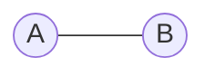

### Grafo orientado

Este é tipo é o caso contrário ao tipo descritp acima, neste tipo de grafo as arestas tem uma direção definida, sendo representada por `(u, v)` indicando que o caminho só pode ser seguido de `u` para `v`. Também conhecido como grafo direcionado ou dirigido, ou também digrafo (digraph) em alguns artigos.

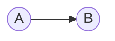

### Grafo Ponderado

Neste tipo de grafo as arestas possuem um valor, que podem ser custo, ganho, resistência, distância, ou qualquer outra ponderação relevante.

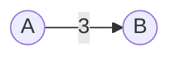

### Grafo Completo

Um grafo onde todos os pares de vértices estão conectados por uma aresta.

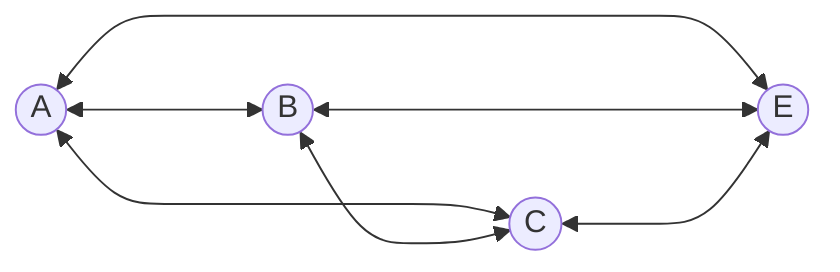

### Grafo Bipartido

Um grafo onde os vértices podem ser divididos em dois conjuntos disjuntos, de forma que cada aresta conecta um vértice de um conjunto a um vértice do outro.

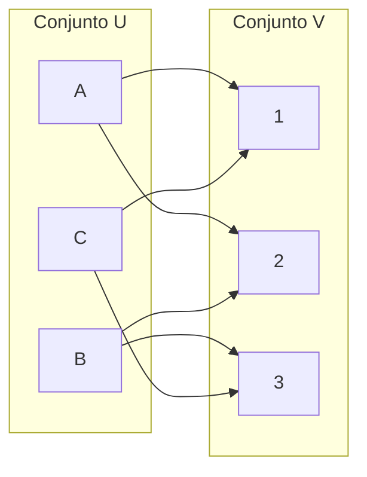

### Grafo Cíclico

Contém pelo menos um ciclo, ou seja, um caminho fechado onde um vértice pode ser alcançado a partir de si mesmo.

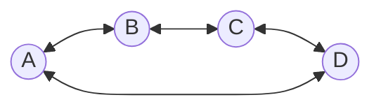


### Grafo Acíclico

Não possui ciclos.

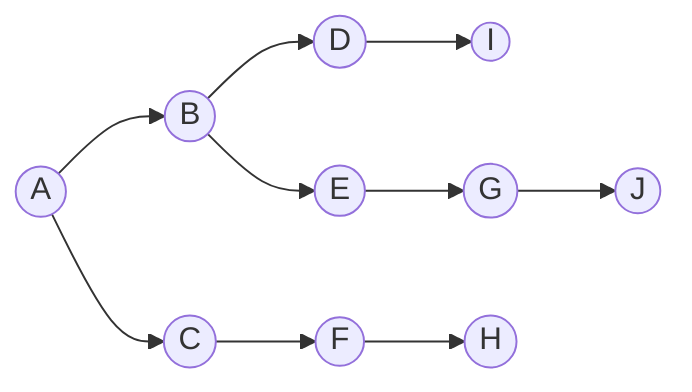

### Árvore

Um grafo conectado e acíclico que formam uma estrutura hierárquica que tem origem ou destino no que chamamos de nó raíz. Cada nó, exceto o nó raíz possui um único nó pai.

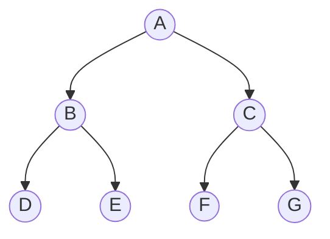

### Grafo Acíclico Direcionado (DAG - Directed Acyclic Graph)

Um grafo direcionado que não possui ciclos. Muito utilizado em modelos de dependências, sistemas de compilação, e algoritmos de ordenação topológica.

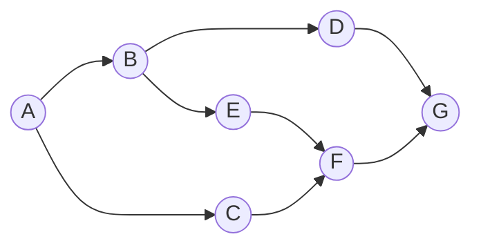

Os tipos de grafos citados acima não são os únicos, há inumeros outros tipos, mas estes são os principais e que mais nos deparamos no dia a dia ou em entrevistas.

**Observação**: É também comum ouvir-mos falar em **Arcos** e **Arestas**. Apesar de serem utilizados como sinônimos, existe uma diferença subtil entre eles. A principal diferença é que **Arcos** são utilizados em grafos orientados e **Arestas** em grafos não orientados.


## Formas de representação de grafos

Uma das primeiras coisas que devemos entender é que existem várias formas de representar um grafo, cada uma com suas vantagens e desvantagens. As mais comuns são:


### 1. Matriz de Adjacência
- Utiliza uma **matriz bidimensional (n x n)**, onde `n` é o número de vértices.
- Se existe uma aresta entre os vértices `u` e `v`, então `matrix[u][v] = 1`, caso contrário, `matrix[u][v] = 0`.
- Ou no caso de grafos ponderados, `matrix[u][v] = peso`, caso contrário, `matrix[u][v] = infinito` ou outro valor que represente a ausência de aresta.

**Vantagens**:
- Acesso rápido a uma aresta específica em **O(1)**.
- Simples de implementar.

**Desvantagens**:
- Ocupa **O(V²)** de espaço, mesmo que o grafo tenha poucas arestas (esparsos).
- Ineficiente para grafos esparsos.


#### Grafos não orientados

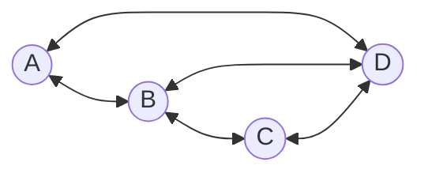

|   | A | B | C | D |
|---|---|---|---|---|
| A | 0 | 1 | 0 | 1 |
| B | 1 | 0 | 1 | 1 |
| C | 0 | 1 | 0 | 1 |
| D | 1 | 1 | 1 | 0 |

**Observações**:
- Quando trabalhamos com grafos não orientados, podemos observar que a matriz de adjacência é simétrica em relação à diagonal principal. Isso ocorre porque a relação entre os vértices `u` e `v` é a mesma que entre `v` e `u`.

**Exemplo**:
```python
class GraphMatrix:
  def __init__(self, size):
    self.matrix = [[0] * size for _ in range(size)]
    self.size = size

  def add_edge(self, u, v):
    self.matrix[u][v] = 1
    self.matrix[v][u] = 1

  def remove_edge(self, u, v):
    self.matrix[u][v] = 0
    self.matrix[v][u] = 0

  def display_matrix(self):
    print("Adjacency Matrix:")

    for row in self.matrix:
      print(row)

  def display_edges(self):
    print("Edges:")

    for u in range(self.size):
      for v in range(self.size):
        if self.matrix[u][v] == 1:
          print(f"Edge {u} -> {v}")


graph = GraphMatrix(4)

graph.add_edge(0, 1)
graph.add_edge(1, 2)
graph.add_edge(2, 3)
graph.add_edge(3, 0)

graph.display_matrix()
graph.display_edges()
```

#### Grafos orientados

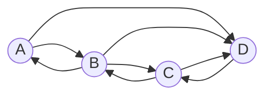

|   | A | B | C | D |
|---|---|---|---|---|
| A | 0 | 1 | 0 | 1 |
| B | 1 | 0 | 1 | 1 |
| C | 0 | 1 | 0 | 1 |
| D | 0 | 0 | 1 | 0 |

**Observações**:
- Na matriz de adjacência para grafos orientados, a direção da aresta é determinada pela leitura da linha para a coluna. Por exemplo, o valor 1 na posição [A,B] significa que existe uma aresta partindo de A para B.
- Podemos interpretar como: se `matrix[u][v] = 1`, então existe uma aresta do vértice u para o vértice v.

**Exemplo**:
```python
class GraphMatrix:
  def __init__(self, size):
    self.matrix = [[0] * size for _ in range(size)]
    self.size = size

  def add_edge(self, u, v):
    self.matrix[u][v] = 1

  def display_matrix(self):
    print("Adjacency Matrix:")

    for row in self.matrix:
      print(row)

  def display_edges(self):
    print("Edges:")

    for u in range(self.size):
      for v in range(self.size):
        if self.matrix[u][v] == 1:
          print(f"Edge {u} -> {v}")


graph = GraphMatrix(4)

graph.add_edge(0, 1)
graph.add_edge(1, 2)
graph.add_edge(2, 3)
graph.add_edge(3, 0)

graph.display_matrix()
graph.display_edges()
```


### 2. Lista de Adjacência
- Utiliza uma **lista de listas**, onde cada índice representa um vértice e a lista contém seus vizinhos.
- Ou uma **Hash Table** onde a chave é o vértice e o valor é uma outra Hash Table ou lista com os vizinhos.

**Vantagens**:
- Economiza espaço **O(V + E)** (ótimo para grafos esparsos).
- Melhor para percorrer vizinhos de um nó (**O(k)** onde `k` é o número de vizinhos).
  - No caso de utilizarmos uma Hash Table, podemos acessar diretamente a um vizinho, reduzindo a complexidade para **O(1)**.

**Desvantagens**:
- Acesso a uma aresta específica é **O(E)** (precisa percorrer a lista).
  - Mas como mencionado anteriormente, quando é utilizado uma Hash Table, o acesso é **O(1)**.

**Exemplo**:
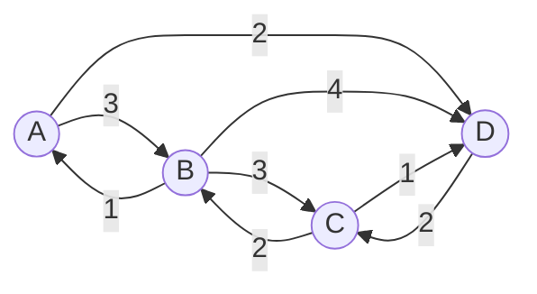
```python
graph = {
  'A': { 'B': 3, 'D': 2 },
  'B': { 'A': 1, 'C': 3, 'D': 4 },
  'C': { 'B': 2, 'D': 1 },
  'D': { 'C': 2 }
}
```
```python
class Graph:
  def __init__(self):
    self.graph = {}

  def add_edge(self, u, v, weight):
    if u not in self.graph:
      self.graph[u] = {}

    if v not in self.graph:
      self.graph[v] = {}

    self.graph[u][v] = weight

  def display_edges(self):
    print("Edges:")

    for node in self.graph:
      for (neighbor, cost) in self.graph[node].items():
        print(f"Edge {node} --{cost}-> {neighbor}")


graph = Graph()

graph.add_edge('A', 'B', 3)
graph.add_edge('A', 'D', 2)
graph.add_edge('B', 'A', 1)
graph.add_edge('B', 'C', 3)
graph.add_edge('B', 'D', 4)
graph.add_edge('C', 'B', 2)
graph.add_edge('C', 'D', 1)
graph.add_edge('D', 'C', 2)

graph.display_edges()
```


### 3. Lista de Arestas
- Armazena o grafo como uma lista de tuplas `(u, v, peso)`, onde `u` e `v` são vértices e `peso` é opcional. A ordem dos elementos na tupla pode variar dependendo da implementação.

**Vantagens**:
- Compacta (mais útil em algoritmos como Kruskal).
- Simples de implementar.

**Desvantagens**:
- Ineficiente para buscar vizinhos de um nó específico.

**Exemplo**:
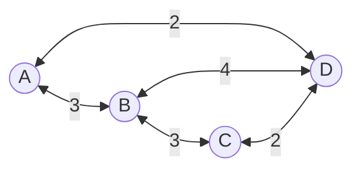
```python
edges = [
  (3, 'A', 'B'),
  (2, 'A', 'D'),
  (3, 'B', 'C'),
  (4, 'B', 'D'),
  (2, 'C', 'D')
]
```
```python
class Graph:
  def __init__(self):
    self.edges = []

  def add_edge(self, u, v, weight):
    self.edges.append((weight, u, v))

  def remove_edge(self, u, v):
    for edge in self.edges:
      if edge[1] == u and edge[2] == v:
        self.edges.remove(edge)
        break
      elif edge[1] == v and edge[2] == u:
        self.edges.remove(edge)
        break

  def display_edges(self):
    print("Edges:")

    for edge in self.edges:
      print(f"Edge {edge[1]} --{edge[0]}-> {edge[2]}")


graph = Graph()

graph.add_edge('A', 'B', 3)
graph.add_edge('A', 'D', 2)

graph.add_edge('A', 'C', 9)
graph.remove_edge('A', 'C')

graph.add_edge('B', 'C', 3)
graph.add_edge('B', 'D', 4)
graph.add_edge('D', 'C', 2)

graph.display_edges()
```


### Comparação das Representações

| Representação            | Espaço | Inserção | Remoção | pesquicar de Aresta |
|--------------------------|--------|----------|---------|---------------------|
| **Matriz de Adjacência** | O(V²)  | O(1)     | O(1)    | O(1)                |
| **Lista de Adjacência**  | O(V+E) | O(1)     | O(E)    | O(1)                |
| **Lista de Arestas**     | O(E)   | O(1)     | O(E)    | O(E)                |

**Quando usar cada uma?**
- **Matriz de Adjacência**: Quando o grafo for **denso** (muitas arestas) e precisarmos de pesquisas rápidas em `O(1)`.
- **Lista de Adjacência**: Quando o grafo for **esparso** (poucas arestas) e queremos eficiência no uso de memória.
- **Lista de Arestas**: Quando estivermos a trabalhar com **algoritmos de grafos como Kruskal**, onde a lista de arestas é essencial.


## Perceber um problema

Uma das coisas mais complicadas quando começamos a estudar algoritmos e estruturas de dados é identificar quando um problema pode ser resolvido com uma determinada estrutura de dados, ou termos a capacidade abstrata de indentificar coisas que a partida parecem não ter relação, mas que podem ser resolvidas com um algoritmo específico.

Vamos excercitar um pouco essa habilidade com um problema prático.

Vamos pensar que temos um labirinto, onde temos um cãozinho que quer chegar até ao osso.


A forma mais simples de representar um labirinto é sombre a forma de uma matriz, onde cada célula representa uma posição no plano que o cãozinho pode estar.

**Mas de forma isso se pode relacionar com grafos?**

Vamos imaginar uma matrix onde estamos posicionados na célula (1, 1) e onde podemos mover-nos ortogonalmente (⬅️ ➡️ ⬆️ ⬇️)


Os possiveis movimentos que podemos fazer são:

* De (1, 1) para (2, 1) - ➡️ - possivel ✅
* De (1, 1) para (1, 2) - ⬇️ - possivel ✅
* De (1, 1) para (0, 1) - ⬅️ - possivel ✅
* De (1, 1) para (1, 0) - ⬆️ - possivel ✅

Agora vamos representar esses movimentos como um grafo.

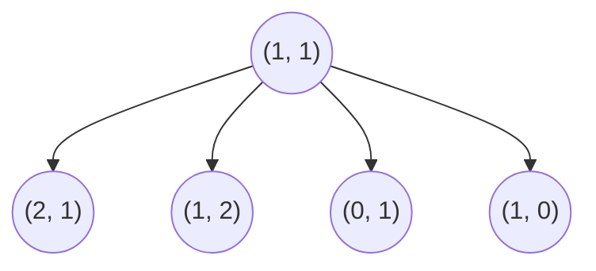

Agora imaginando que chegamos a célula (0, 1), os possiveis movimentos que podemos fazer são:

* De (0, 1) para (1, 1) - ➡️ - possivel ✅
* De (0, 1) para (0, 2) - ⬇️ - possivel ✅
* De (0, 1) para (-1, 1) - ⬅️ - impossivel ❌ - fora do labirinto
* De (0, 1) para (0, 0) - ⬆️ - possivel ✅

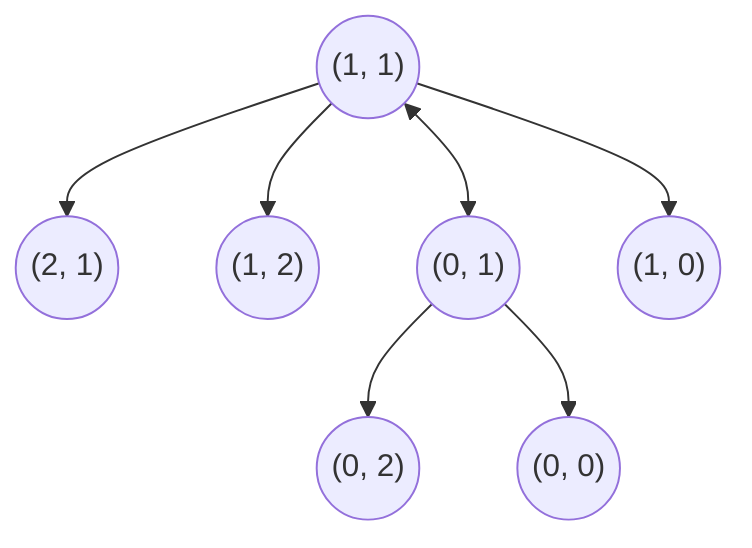

Agora chegamos a célula (0, 0), os possiveis movimentos que podemos fazer são:

* De (0, 0) para (1, 0) - ➡️ - possivel ✅
* De (0, 0) para (0, 1) - ⬇️ - possivel ✅
* De (0, 0) para (-1, 0) - ⬅️ - impossivel ❌ - fora do labirinto
* De (0, 0) para (0, -1) - ⬆️ - impossivel ❌ - fora do labirinto

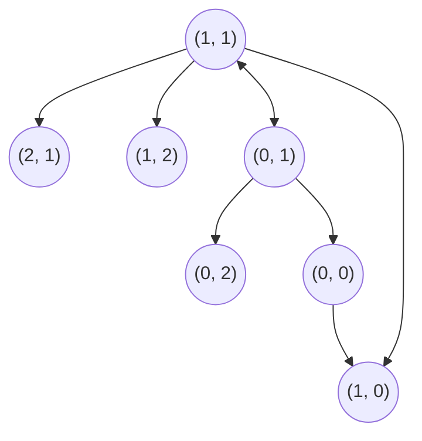

E assim sucessivamente. Ate chegarmos a algo como:

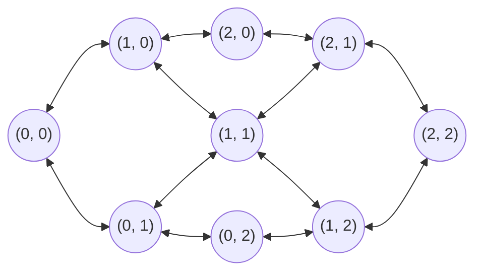

Vamos voltar ao exemplo do cãozinho no labirinto. Se pensarmos bem, os movimentos que o cãozinho pode fazer a encontrar o osso podem ser representados da seguinte forma:

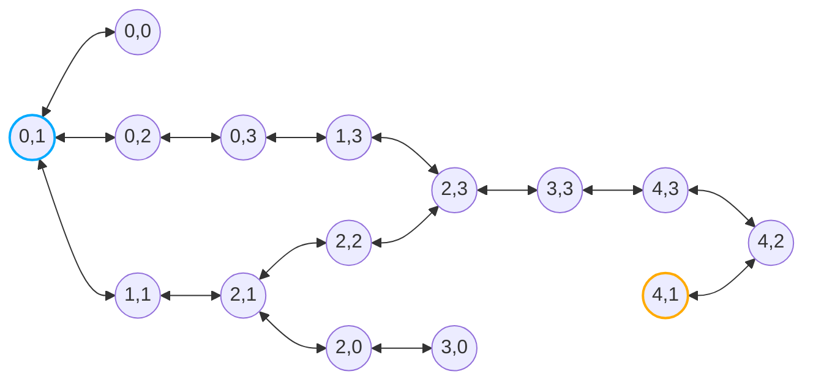

Agora que temos uma visão do problema de movimentação do cãozinho no labirinto, em forma de grafo, podemos desbloquear o potencial de algoritmos de grafos para resolver o problema, como por exemplo o algoritmo de busca em largura (BFS) ou busca em profundidade (DFS) ou até algoritmos mais sofisticados como o algoritmo de Dijkstra ou A*.

Aqui fica alguns repositorios com exemplos de implementações de algoritmos de grafos:

- [Travessia em Grafos](https://github.com/NelsonBN/algorithms-data-structures-graph-traversal)
- [Dijkstra](https://github.com/NelsonBN/algorithms-data-structures-dijkstra)
- [A*](https://github.com/NelsonBN/algorithms-data-structures-a-star)


## Referências
- [Código com exemplos de representação de grafos](https://github.com/NelsonBN/algorithms-data-structures-graphs-representation)
