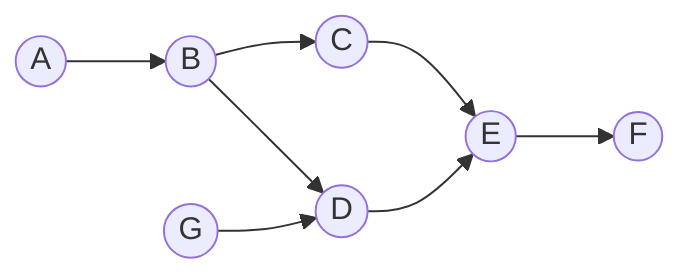
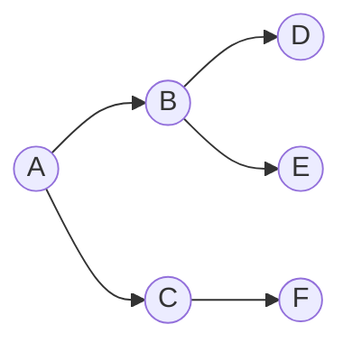
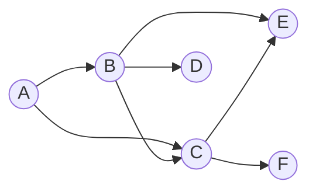
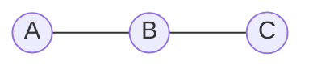
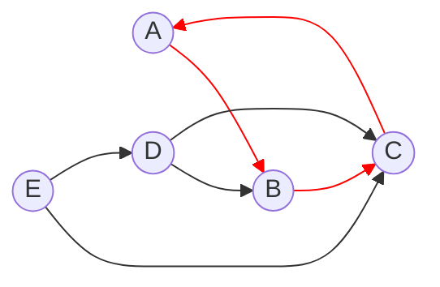
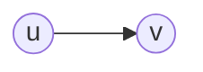
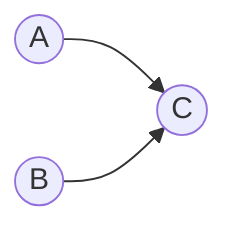
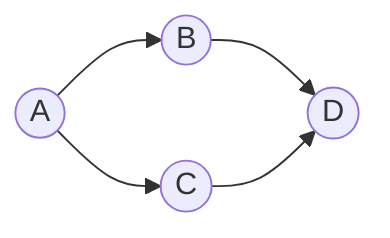

## O que é Ordenação Topológica?

A **Ordenação Topológica** é uma categoria de problemas dentro da teoria dos grafos, tal como acontece com o **Caminho Mínimo** e a **Árvore Geradora Mínima**. É uma forma de linearizar os vértices de um **grafo direcionado acíclico (DAG - Directed Acyclic Graph)** de forma a obter uma ordem linear entre os vértices do grafo.


## Aplicabilidade da Ordenação Topológica

* **Gestão de Tarefas**: Garantir que as dependências de uma tarefa sejam tratadas antes da própria tarefa.
* **Compiladores**: Se um ficheiro `A` precisa ser compilado antes do `B`, um compilador pode usar ordenação topológica para definir a ordem correta de compilação.
* **Contêiner de Injeção de Dependências**: Se um serviço `A` depende de um serviço `B`, o contêiner de Injeção de Dependências pode usar ordenação topológica para resolver os serviços na ordem correta.
* **Planeamento de um Curso**: Imaginando que determinado tópico do curso tenha alguma base fundamental de outros tópicos, a ordenação topológica pode ser utilizada para definir o cronograma. Um exemplo disso é o nosso learning path [Algoritmos & Estruturas de Dados - From Zero to Hero](https://www.youtube.com/playlist?list=PLl10TyPY67Jgbh4QdRlRKr-7PjB9i5hWg)


## Conceitos e requisitos

### O Grafo tem que ser um DAG

Para implementar a ordenação topológica, é necessário que o grafo seja um **DAG** (Directed Acyclic Graph), ou seja, um grafo direcionado sem ciclos.

**Exemplos de Grafos que são DAG**:




**Exemplos de Grafos que não são DAG**:

> Não é direcionado

> Tem um ciclo

### Precedência de dependências

Na ordenação topológica, as dependências de um determinado vértice sempre aparecem antes do vértice em questão. Isso significa que, se `G` contém uma aresta direcionada `(u, v)`, o vértice `u` aparece antes do vértice `v` na ordenação.

**Exemplo**:

* vértices: `u` e `v`
* Aresta: `(u, v)`


```python
order = ['u', 'v']
```

### Poder existir várias ordenações topológicas

Para o mesmo grafo, podem existir várias ordenações topológicas. Isso ocorre porque a ordem de execução de tarefas independentes pode variar.

**Exemplo**:

Se `A` não depende de `B` e vice-versa, então `A` e `B` podem ser executados em qualquer ordem. O requisito é que `C` deve ser executado após `A` e `B`. Portanto, as seguintes ordenações são válidas:

* `A -> B -> C`
* `B -> A -> C`


### Grau de entrada e grau de saída

Outro conceito importante que nos ajudará a perceber algumas implementações de algoritmos de ordenação topológica é o conceito de **grau**.

* **Grau de entrada**: número de arestas que entram em um vértice. Em inglês, **in-degree**. O grau de entrada irá representar o número de dependências que um vértice tem. Ou seja, de quantos vértices o vértice em questão depende.
* **Grau de saída**: número de arestas que saem de um vértice. Em inglês, **out-degree**. O grau de saída irá representar o número de vértices que dependem do vértice em questão. Ou seja, quantos vértices dependem do vértice em questão.

**Exemplo**:

| vértice | Grau de entrada | Grau de saída |
|---------|-----------------|---------------|
| A       | 0               | 2             |
| B       | 1               | 1             |
| C       | 1               | 1             |
| D       | 2               | 0             |

- **Um vértice com grau de entrada igual a zero (`deg−(v) = 0`)**: é chamado de **Source vertex** ou em português **vértice fonte**. É um vértice que não recebe arestas, sendo a origem das suas arestas de saída.
- **Um vértice com grau de saída igual a zero (`deg+(v) = 0`)**: é chamado de **Sink vertex** ou em português **vértice sumidouro**. É um vértice que só recebe arestas, sendo o destino para as suas arestas de entrada.
- **Um vértice com grau de entrada e grau de saída igual a zero (`deg−(v) = 0` e `deg+(v) = 0`)**: é chamado de **Isolated vertex** ou em português **vértice isolado**. É um vértice que não tem arestas de entrada nem de saída. Ou seja, nenhum outro vértice depende dele e ele não depende de nenhum outro vértice.

> **Nota**: Um grafo que contenha apenas vértices isolados também possui uma ordenação topológica. Pois tecnicamente ainda é um DAG.


## Implementação

A **Ordenação Topológica** pode ser resolvida por algoritmos como o de Kahn e o de pesquisa em profundidade (DFS). Existem outros algoritmos, mas os mais comuns são os de Kahn e de pesquisa em profundidade (DFS). Neste artigo, é deles que falaremos.

### Algoritmo de Kahn

O primeiro algoritmo que vamos ver é o **algoritmo de Kahn**. Este algoritmo é baseado no conceito de grau de entrada dos vértices. E na estratégia de ir consecutivamente eliminando os **vértices fontes**. Além de resolver o problema da ordenação topológica, o algoritmo de Kahn também detecta facilmente a existência de ciclos no grafo.

#### Algoritmo de Kahn - Pseudocódigo

* Entrada: Grafo G com V vértices e E arestas (representado por lista de adjacência)
* Saída: Lista ordenada topologicamente ou erro se houver ciclo.

1. Inicializar um vetor de tamanho V com zeros, onde cada posição `i` representa o grau de entrada do vértice `i`. Ou seja, quando o algoritmo começa, o grau de entrada de cada vértice é 0.

2. Para cada vértice `u` em `G`:
   1. Para cada vértice `v` adjacente a `u`: Incrementar um grau

3. Inicializar uma `fila` com todos os vértices que têm grau de entrada 0. Ou seja, todos os vértices que não têm dependências.

4. Inicializar lista `topological_order` vazia

5. Enquanto a `fila` não estiver vazia:
   1. Retirar o próximo vértice `u` da fila e adicionar `u` à lista `topological_order`
   2. Para cada vértice `v` adjacente a `u`:
      1. Decrementar o grau de entrada de `v` em 1
      2. Se o grau de entrada de `v` for igual a 0, adicionar `v` à fila

6. Se o tamanho da lista `topological_order` for igual a V:
  Retornar topological_order . Senão, significa que o grafo contém um ciclo. Portanto, retornar erro porque não é possível fazer a ordenação topológica.


#### Algoritmo de Kahn - Implementação

```python
from collections import defaultdict, deque

def kahn(graph):
  in_degree = defaultdict(int) # Track in-degree for each vertex/node (O(V))

  # Step 1: Compute in-degrees (O(E))
  for u in graph:
    if u not in in_degree:
      in_degree[u] = 0
    for v in graph[u]:
      in_degree[v] += 1

  # Step 2: Enqueue vertices with in-degree 0 (O(V))
  queue = deque()
  for u in in_degree:
    if in_degree[u] == 0:
      queue.append(u)

  topological_sorting = []

  # Step 3: Process until queue is empty
  while queue: # O(V + E)
    u = queue.popleft() # Remove node from queue (O(1))
    topological_sorting.append(u) # Add to topological order (O(1))

    # Guard rail to ensure the vertex exists in the graph as a key.
    # This can happen when a node is a leaf node and has no outgoing edges.
    if u not in graph:
      continue

    # Decrease in-degree of all adjacent vertices (O(E))
    for v in graph[u]:
      in_degree[v] -= 1
      if in_degree[v] == 0: # If a vertex has no more incoming edges, it can be processed as all its dependencies are satisfied
        queue.append(v)

  if len(topological_sorting) != len(in_degree):
    raise Exception("Graph contains at least one cycle - Topological sort is not possible")

  return topological_sorting

graph = {
  'A': ['B'],
  'B': ['C', 'D'],
  'C': ['E'],
  'D': ['E', 'F'],
  'E': ['G'],
  'F': ['G']
}

print(f'Topological Sorting: {kahn(graph)}')
```

#### Complexidade

* **Complexidade de tempo:** O(V + E), onde V é o número de vértices e E é o número de arestas no grafo. Isso ocorre porque o algoritmo percorre todos os vértices e arestas uma vez.
* **Complexidade de espaço:** O(V), onde V é o número de vértices. Isso ocorre porque o algoritmo armazena os graus de entrada e a fila de vértices com grau de entrada 0.


### Ordenação Topológica com DFS

O segundo algoritmo que vamos ver é a **Ordenação Topológica com DFS**. Este algoritmo é baseado na pesquisa em profundidade (DFS) e aplicando uma estratégia Post-Order. Ou seja, o algoritmo percorre todos os vértices e arestas do grafo, e quando terminar de visitar um vértice, ele adiciona esse vértice ao final da lista de ordenação topológica, que será invertida no final para obter a ordem correta.

#### Algoritmo de Ordenação Topológica com DFS - Pseudocódigo

* Entrada: Grafo G com V vértices e E arestas (representado por lista de adjacência)
* Saída: Lista ordenada topologicamente ou erro se houver ciclo.

1. Criar uma hashtable para marcar o estado de cada vértice

2. Para cada vértice `u` em `G`:
   1. Marcar `u` como `NOT_VISITED` e para cada vértice `v` adjacente a `u`, marcar também `v` como `NOT_VISITED`

2. Criar lista vazia que irá armazenar a ordenação topológica

3. Iniciar a iteração dos vértices de `G`:
   1. Inicia-se a pesquisa em profundidade para cada vértice
      1. Se o vértice já foi visitado, para a pesquisa em profundidade
      2. Se o vértice já está a ser visitado, lançar um erro pois o grafo contém um ciclo
      3. Caso contrário, marcar o vértice como `VISITING` e continuar a pesquisa em profundidade

      4. Se o vértice atual não tiver vizinhos, marcar o vértice como `VISITED` e adicionar o vértice no final da lista de ordenação topológica

4. Quando terminar a iteração em todos os vértices, inverte a lista de ordenação topológica e retorna a lista


#### Algoritmo de Ordenação Topológica com DFS - Implementação

```python
NOT_VISITED = 0
VISITING = 1
VISITED = 2

def topological_sort_dfs(graph):
  # Track the state of each vertex
  state = {}

  # Initialize states for all vertices
  for u in graph:
    state[u] = NOT_VISITED
    # Ensure all adjacent vertices are also included in our tracking dictionary
    for v in graph[u]:
      if v not in state:
        state[v] = NOT_VISITED

  # Result list to store the topological order
  result = []

  def dfs(vertex):
    # If the vertex is already processed, no need to visit again
    if state[vertex] == VISITED:
      return

    # If the vertex is currently being processed, we've detected a cycle
    if state[vertex] == VISITING:
      raise Exception("Graph contains at least one cycle - Topological sort is not possible")

    # Mark the vertex as being processed in the current traversal
    state[vertex] = VISITING

    # Process all adjacent vertices
    if vertex in graph: # Check if the vertex has any outgoing edges
      for adjacent in graph[vertex]:
        dfs(adjacent)

    # Mark the vertex as processed and no longer in the current traversal
    state[vertex] = VISITED

    result.append(vertex) # Push the vertex after visiting all neighbors (O(1))

  # Call DFS for each unvisited vertex
  for vertex in state:
    dfs(vertex)


  # Reverse the list to get the correct topological order
  return result[::-1]

graph = {
  'A': ['B'],
  'B': ['C', 'D'],
  'C': ['E'],
  'D': ['E', 'F'],
  'E': ['G'],
  'F': ['G']
}

print(f'Topological Sorting: {topological_sort_dfs(graph)}')
```

#### Complexidade

* **Complexidade de tempo:** O(V + E), onde V é o número de vértices e E é o número de arestas no grafo. Isso ocorre porque o algoritmo percorre todos os vértices e arestas uma vez.
* **Complexidade de espaço:** O(V), onde V é o número de vértices. Isso ocorre porque o algoritmo armazena os estados dos vértices e a lista de ordenação topológica.


## Características observáveis

Com o que vimos até agora, podemos concluir algumas características:

* Todo o grafo **DAG** tem pelo menos uma ordenação topológica.
* Se um grafo é acíclico, então tem pelo menos uma ordenação topológica. Também podemos afirmar o contrário, ou seja, se um grafo tem uma ordenação topológica, então o grafo é acíclico.
* Se não é possível fazer a ordenação topológica, então o grafo tem um ciclo. Isso significa que não é possível linearizar os vértices do grafo.
* Se utilizamos o algoritmo de Kahn, e quando estamos a processar a `fila`, se em algum momento existir nela mais de um vértice de grau de entrada 0, então o grafo tem mais que uma ordenação topológica. Se sempre existir no máximo um vértice de grau de entrada 0, então o grafo tem apenas uma ordenação topológica.


## Referências
- [Código de exemplo ordenação topológica - DFS](https://github.com/NelsonBN/algorithms-data-structures-topological-sorting-dfs)
- [Código de exemplo do algoritmo de Kahn](https://github.com/NelsonBN/algorithms-data-structures-kahn)
- [Wikipedia - Topological sorting](https://en.wikipedia.org/wiki/Topological_sorting)
- [Wikipedia - DAG](https://en.wikipedia.org/wiki/Directed_acyclic_graph)
